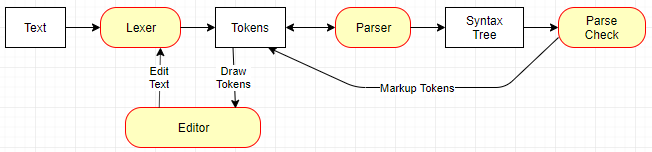

# Architectural Overview

### Lexer

The `Lexer` breaks the text into the tokens of the language.  Once tokenized, 
they can be enumerated and marked up by the `Parser` or displayed by the 
`Editor`.  Each token carries enough information to display its color (i.e. 
token type) or give the user feedback from the parser and code generator. 
`ReplaceText` can be used to insert or delete text, and the tokens in the 
affected area will be regenerated.

### Editor

The `Editor` control uses the `Lexer` to enumerate the tokens, draw them
on the screen, and edit the text.  User edits are sent to the lexer
which then sends a `TextChanged2` event back to the application so it can
recompile the code.  Text changes are recorded to implement undo/redo.

The application uses `TokenColorOverrides` to draw different color 
backgrounds as the user moves the mouse over the text.  It also hooks
`MouseHoverTokenChanged` to display information reported by the parser
and code generator, such as error or type information.

### Parser

The `Parser` is recursive descent, and generates a syntax tree.  As it
parses, the tokens are marked with information such as error messages and
connecting parenthesis.

# Thoughts on Implementation

Very WIP...

## Class Objects

Like in C#, all `class` objects live on the heap.

An object has a VTable and optionally a length of elements:

    struct Object 
    {
        VT ^VTable   // All heap objects
        Count int   // Only when inheriting from VariableSizedObject
    }

The VTable contains the object size and reference layout:

    struct VTable 
    {
        SizeOfObject int             // Size of object, not including array elements
        SizeOfElement int            // Size of element, or zero when not variable sized
        ObjectRefLayout ^RefLayout   // Null if object doesn't contain references
        ElementRefLayout ^RefLayot   // Null if elements don't contain references
        // Other information (type, virtual functions, etc.)
    }

All objects are a multiple of 64 bits, and the size of A can be calculated with
`(A.VT.SizeOfObject + ((A.VT.SizeOfElement*A.Length+7)&~7)`.

## Garbage Collection

**NOTE:** The garbage collector will probably not be compacting, so the discussiob
below needs to be updated for that.

The goal is to be as fast as possible and have as little memory overhead as possible.
To that end:

* Managed objects know their size and reference layout
* Interior and pinned references are allowed only on the stack
* Interior references are not tracked, instead the object is pinned
* Unreachable objects cannot be resurrected, they are collected immediately
* There are no finalizers, but there are GC notifications
* Pointers are not tracked

### Interior and Pinned References

An interior reference is one that points inside an object rather than
to its beginning.  They are created when you pass the field of an
object by `ref` or `out`.  A `Span` is a wrapper for an interior
reference.

A pinned reference is one that points to an object that cannot be moved
by the GC.  They are used to lock an object in place while there
could possibly be unmanaged pointers or interior references pointing
to an object.  Interior pointers can be created using the `fixed` keyword.

Both kinds of references create problems for the GC.  Pinned references
can fragment memory.  Tracking interior references complicates the design 
of the GC, make it slower, and create problems optimizing the code given
WebAssembly's strict separation of execution and user stacks.

To alleviate these problems, both interior and pinned references
are never allowed to exist on the heap. They are stack only objects.
Furthermore, interior references are not tracked by the GC.  All 
objects that could possibly have an interior pointer are pinned.
Finally, all references existing on the stack are pinned.

These restrictions allow a faster, simpler garbage collector, and
makes some optimizations easier.  For instance, once an object is
recorded on the stack, it can be passed on the execution stack
without shadowing it again.  Interior references to that object can
be created, used, and passed on the execution stack without the need
for the GC to track it.

For example:

    func MyFunc(a SomeObject, b []int, c List<int>) 
    {
        AnotherFunc(a, ref b[1], ref c[1])
    }

`a` has been pinned by the calling function, and can be passed on the
execution stack without further tracking. Likewise, `b` is pinned, and
the interior pointer need not be tracked.  The object `c` was also pinned
by the calling function, however the underlying array used to implement
`List` was not.  In this case, the compiler generates code to pin the
internal array.

### Internal Ref Returns

When an interior reference is passed *in* to a function, it is just a pointer
to data in a pinned object.  However, when an interior referenced is passed
*out* of a function, the object it tracks must stay pinned for the duration
of the calling function.  To solve this problem, fat pointers are used for
ref returns.  The fat pointer contains a reference to the object, which must
stay pinned, as well as the reference to data with that object.

    func MyParse(a Slice<byte>) int 
    {
        return DoSomeParsing(a)
    }
    func MySlice() Slice<int> 
    {
        if (SomeSpecialStateVariabe)
            { return InternalArrayA.Slice(1, 4) }
        else
            { return InternalArrayB.Slice(2, 8) }
    }

In the case of `MyParse`, the `Slice` is just two fields, a reference and
the number of elements.  Whatever object `a` references is pinned.  But,
in the case of `MySlice`, the object would not be pinned by the calling
function.

Using a fat pointers solves this problem. 

    struct Ref<T> { ro PointerInsideOfPinnedObject ^void }
    struct RefReturn<T> { ro PinnedObject Object; ro PointerInsideOfObject ^void }
    
    ro ref struct Normal_Span<T>  
    {
        ro Pointer Ref<T>
        ro Length int
        func this[int index] ref T { ... }
    }
    ro ref struct RefReturn_Span<T>  
    {
        ro Pointer RefReturn<T>
        ro Length int
        func this[int index] ref T { ... }
    }

`Normal_Span` is used when passing a `Span` *in* to a function, and `RefReturn_Span` is
used when passing a `Span` *out* of a function.   Note that returning a reference
to a member field of `this` can be optimized to use `Ref` instead of `RefReturn`.  So,
`myArray[n]` creates a regular reference.  On the other hand, `myList[n]` uses a
`refReturn` to lock the underlying array in place if the reference is passed to
a function.

### Pointers

Pointers are never tracked.  When using pointers, it's the programmer's
responsibility to ensure everything is correct.  Pointers should never
point into a managed object except while it is pinned using the `fixed`
keyword.

This is an example of pinning an object while calling an unmanged function:

    // Unmanaged function and data structure
    struct Line { x1 int;  y1 int;  x2 int;  y2 int }
    extern func DrawLines(lines ^Line, numLines int)

    func DrawMyFigure() 
    {
        @figure = new Line[30]
        // Fill figure with lines
        unsafe 
        {
            // Say we only want to draw the middle 10 lines
            @linePtr = fixed(#^int(&figure[10]));
            DrawLines(linePtr, 10);
        }
    }

### Object Finalization and Resurrection

There is no object resurrection.  Once the object is unreachable, the memory
is immediately reclaimed.  To cover the case where the object holds unmnaged
memory, use `UnmanagedMemory` instead.

To deal with  other situations, inherit from `FinalizeNotify` and call 
`SetFinalizeNotifier`.  When the object is collected, the notification
is sent to the object's `notifierQueue`

    // Base class for all things that need to notify when they are garbage collected
    class FinalizedNotify
    {
        protected func SetFinalizeNotifier(notifierQueue FinalizedNotifyQueue, token IntPtr, memoryPressure int)
        protected func ClearFinalizeNotifier()
    }
    class FinalizedNotifyQueue
    {
        func get Count int;
        func Dequeue() IntPtr;
        afunc WaitQueueNotEmpty();
    }

With these two classes, a manager can be created that deletes the
collected objects. The token can wrap an OS handle, or it can be
used to look up object information in a map.

    class MyFinalizableObject : FinalizeNotify
    {
        static sFinalizeQueue = new FinalizedNotifyQueue();
        static construct() 
        {
            astart DisposeManager();
        }
        static afunc DisposeManager() 
        {
            sFinalizeQueue.WaitQueueNotEmpty();
            while sFinalizeQueue.Count != 0 
            {
                @token = sFinalizeQueue.Dequeue();
                // If it's just an OS handle, close it here
                // If it needs more than can fit in an IntPtr, use a map to find the info
            }

        func Open() 
        {
            // Create the resource, associate a token with the object
            @token = OsOpenFile() // Assume the OS returns an IntPtr handle
            SetFinalizeNotifier(sFinalizeQueue, token, 8000); // Assume the file handle consumes 8000 bytes
        }

        func Close() 
        {
            ClearFinalizeNotifier();
        }
    }

### Escape Analysis, Owned Objects, and Deterministic GC

To help the GC do its job better, the compiler will detect when local objects
cannot escape from the function.  These objects can be stored on the stack
and deleted at the end of the function.  Consider:

    func DrawBitmap(Bitmap bm, Bitmap overlay) Bitmap 
    {
        @bigBm = bm.Scale(3);
        @bigOverlay = overlay.Resize(bigBm.Width, bigBm.Height);
        return bigBm.AlphaBlend(bigOverlay, 0.3);
    }

In this case, assuming the compiler can prove that `bigBm` and
`bigOverlay` cannot leak, these objects will be deleted when the 
function exits.  The compiler may choose to use `stackalloc` or
`malloc` depending on the object size.  This is very close to
deterministic garbage collection, but is safe and more flexible.  

Now consider that the Bitmap is just a wrapper that holds bits.
We want to write the class in a way that the optimizer can prove 
that the bits won't leak and may be collected deterministically.
The `owned` qualifier will help us do that:

    // This bitmap can hold its bits in managed or unmanaged memory depending on the need
    class Bitmap 
    {
        owned ManagedBits []int;
        owned UnmanagedBits UnmanagedMemory<int>;

        // Illegal, `ManagedBits` cannot not be leaked
        pub func GetManagedBits() []int
            => return ManagedBits
        pub func ThisCouldDefeatOwned()
            => IMustDoSomethingThatCaptures(ManagedBits)

        // This is Ok, these are ref returns
        pub func PixelAt(x int, y int) ref int
            => return ref ManagedBits[y*Width + x];
        pub func HorizontalSlice(x int, y int, length int) Span<int>
            => return ManagedBits.Slice(y*Width+x, length);
        pub func ThisCannotDefeatOwned()
            => IMustNotDoSomethingThatCaptures(ref ManagedBits)

        // These functions don't leak, they just manipulate data
        pub func Scale(scale float32) Bitmap {}
        pub func Resize(width int, height int) Bitmap {}
        pub func AlphaBlend(other Bitmap, transparency foat32) {}
    }

Fields with the `owned` attribute must be assigned only in the
constructor and cannot not be leaked outside the class.  
With all this, `DrawBitmap` should deterministically collect
`bigBm` and `bigOverlay`.  Even when allocated in `UnmanagedMemory`,
the memory will be reclaimed immediately at the end of the function.

A case where deterministic collection will be common is:

    for @a in MyCollection
        { a.DoSomethingThatDoesntLeakTheEnumerator() }

The enumerator will be collected when the function exits.  If the
enumerator inherits from `FinalizeNotify`, the notification will
be also be sent.

## Heap Object Layout

The object can be scanned for references by following `ObjectRefLayout` and
then iterating `length` times over `ElementRefLayout`. RefLayout is:

`struct RefLayout { Skip byte; TypeAndCount byte }`

`Skip` is the number of pointer sized slots to skip, and `TypeAndCount`
is the type or reference and number of references at that location. The
high order two bits contain the type (normal, pinned, interior, or weak) and the low
six bits contain the reference count:

    p ipointer // Points to start of object or stack frame
    r ^RefLayout // Points to start of reference layout table
    while r.Skip != 0 || r.Count != 0 {
        p += sizeof(ipointer)*r.Skip;
        for @count in r.Count & 63 
        {
            @type = r.Count >> 6;
            switch type 
            {
                case 0: NormalReference
                case 1: PinnedReference
                case 2: WeakReference
                case 3: Reserved for future when we might track interior references
            }
        }
    }

## Stack Frames

The execution stack is not accessible by WebAssembly, so two shadow stacks 
are maintained in linear memory.  

The first stack, `SCATCH_STACK`, is scratch memory for anything that can't
live on the execution stack, such as `stackalloc` objects, interior references,
or any addressable object requiring temporary linear memory.  This stack is
not scanned for GC references.

The second stack, `GC_STACK`, is for GC object references, try-finally cleanup
functions, stack trace information, and optional debug information.  This stack
is scanned for GC references and may never hold an interior reference.  Once
an object is on this stack, it is GC pinned and no longer needs to be tracked.

Let's consider some examples.

This function uses no linear stack memory because no exceptions need to be caught,
there are no garbage collected references, and all temprary variables can live on
the execution stack.

    func a(b float64, c float64, d float64) float64 
    {
        // There could be a lot of other temporary variables here.
        // MyFunc1, MyFunc2, or MyFunc3 could throw an exception
        @myTemp1 = MyFunc1(b,c);
        @myTemp2 = MyFunc2(c,d);
        return MyFunc3(myTemp1, myTemp2, b, c, d);
    }

Likewise, this function uses no linear memory stack.  `b` must have already
been placed on `GC_STACK` so it doesn't need to be stored again. Furthermore, 
the `ref b[10]` is a reference to an object that was pinned by the calling
function, so it is also does not need to live on `GC_STACK`.

    func a(b []int) float64 
    {
        return MyFunc1(b, ref b[10]);
    }

This function requires `SCRATCH_STACK` because `d` must be copied
into memory and its address passed as a parameter.  

    func a(b float64) float64 
    {
        return MyFunc1(ref b);
    }

This function requires `GC_STACK` because the reference needs to be
stored so the GC doesn't collect it.  An optimizer coudl remove the
need for `GC_STACK` by proving that no GC could happen in 
`DoSomethingThatCouldTriggerGC`

    func a() string 
    {
        @myTemp = MyStringFunction();
        DoSomethingThatCouldTriggerGC();
        return myTemp;
    }

This function uses `GC_STACK` to allow the `finally` clause to cleanup
when the stack is unwound.  Note that this type of code is implicitly
generated when `lock`, `use`, or `defer` is used.

    func b() string 
    {
        try { return DoSomethingThatCouldThrow(a);  }
        finally  { DoSomething(); }
    }

This function requires execution to continue after an exception is caught.
In this case, the execution stack must not be unwound. Instead, the `try` clause
invokes JavaScript code that can handle the exception and return control back to the 
calling function.  Using `try` and `finally` are not expensive, but catching an
exception and swallowing it is.

    func b() string 
    {
        try { return DoSomethingThatCouldThrow(a);  }
        catch  { LogItAndThenIgnore() } 
    }

### Task Stack Frame Layout

Task stack frames are used to limit the amount of garbage created during async
calls.  The also speed up async function execution.

TBD: describe them.

### Async - Task Stack Frames

`Task<T>` does not live by itself on the heap.  Instead, the first one (allocated
with the `astart` keyword) is created on its own new very light weight stack frame.
Each additional async call uses the callers stack frame for parameters and local
variables.  This reduces the amount of garbage and eliminates the need for ValueTask.

