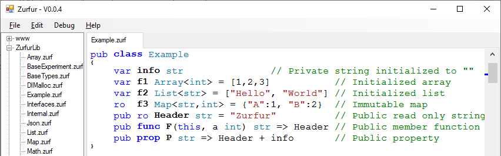

#  Zurfur

Zurfur is is a programming language I'm designing just for fun and enlightenment.
The language is named after our cat, Zurfur, who was named by my son.  It's
spelled **_ZurFUR_** because our cat has fur.

## Overview

I love C#.  It's my favorite language to program in.  But, I'd like to fix
some [warts](http://www.informit.com/articles/article.aspx?p=2425867) and have
some features from other languages built in from the ground up.

Thoughts about where to go and how to do it: [Internals](Doc/Internals.md).

## Design Goals

* Fun and easy to use
* Faster than C# and unsafe code just as fast as C
* Target WebAssembly with ahead of time compilation
* Typesafe replacement for JavaScript
* Stretch goal: Rewrite compiler and IDE in Zurfur on Node.js

Zurfur takes its main inspiration from C#, but borrows syntax and design
concepts from Golang, Rust, Zig, Lobster, and many other languages.
Here are some differences between Zurfur and C#:

* Mutability and nullabilty are part of the type system:
    * References are non-nullable by default, may use `?` for nullable
    * Mutable function parameters must be explicitly marked `mut`
    * Children of read only fields (i.e. `ro` fields) are also read only
    * Get/set of mutable a struct acts as if it were a reference (e.g. `MyListOfStructPoints[1].X = 5`)
    * Functions pass `struct` parameters by reference or value, whichever is more efficient
* Type declaration syntax and operator precedence is from Golang
* Interfaces may be implemented by the class (C# style) or externally (Rust trait style)
* Strings are UTF8 byte arrays, always initialized to ""
* Classes are reference counted (finalized when count goes to zero)
* `==` operator fails if it is not defined on a class (does not default to object comparison)
* Async acts like a blocking call without the `await` keyword (ideal for JavaScript callbacks)

#### Status Update

The syntax is still being developed, nothing is set in stone yet.  Feel
free to send me comments letting me know what you think should be changed.

#### Inspirations

* [Lobster](http://strlen.com/lobster/) - A really cool language that uses reference counting GC
* [Zig](https://ziglang.org/) - A better and safer C
* [Pinecone](https://github.com/wmww/Pinecone/blob/master/readme.md) - Inspiration to keep plugging away

## Functions

    /// This is a public documentation comment.  Do not use XML.
    /// Use `name` to refer to variables in the code. 
    pub static fun Main(args []str)
    {
        // This is a regular private comment
        Console.Log("Hello World, 2+2=" + add(2,2))
    }

    // Regular static function
    pub static fun add(a int, b int) int
        => a + b

**TBD:** Use `func` instead of `fun`?

Functions are declared with the `fun` keyword. The type names come
after each argument, and the return type comes after the parameters.
Functions, classes, structs, enums, variables and constants are
private unless they have the 'pub' qualifier.  Functions are allowed
at the namespace level, but must be static or extension methods.

#### Parameters are passed by reference and immutable by default

By default, functions pass parameters by immutable reference.  The exception
is that small structs may be passed by value when it is more efficient to do so.

    pub fun Test(a      f64,       // Pass by value since that's more efficient
                 s      MyStruct,  // Pass by value or reference whichever is more efficient
                 ms mut MyStruct,  // Pass by reference, preserve `ro` fields
                 rs ref MyStruct,  // Pass by reference, nothing is preserved
                 os out MyStruct,  // MyStruct is returned by reference
                 c      MyClass,   // Pass reference, the object is immutable
                 mc mut MyClass,   // Pass by reference, object is mutable, reference cannot be changed
                 ic ref MyClass,   // Pass by reference, object is mutable, reference can be changed
                 oc out MyClass)   // MyClass is returned by reference

If `s` is big, such as a matrix containing 16 floats, it is passed by
reference.  If it is small, such as a single float or int, it is passed
by value.  A struct containing two integers might be passed by value or
by reference depending on the compiler, options, and optimizations.

Even if `MyStruct` or `MyClass` is mutable, `s` and `c` cannot be mutated.
Only parameters marked with `mut` or `ref` can be mutated.  `out` parameters
must be assigned, never read.

## Local Variables

Within a function, variables are declared and initialized with the `var` keyword:  

    var a = 3                              // `a` is an int
    var b = "Hello World"                  // `b` is a str
    var c = MyFunction()                   // `c` is whatever type is returned by MyFunction
    var d = List<int>([1,2,3])             // `d` is a list of integers, initialized with {1,2,3}
    var e = Map<str,int>({"A":1,"B":2})    // `e` is a map of <str, int>
    var f = Json({"A":1,"B":[1,2,3]})      // `f` is a Json object containing a number and an array

The above form `var variable = expression` creates a variable with the same type as
the expression.  A second form `var variable type [=expression]` creates an explicitly
typed variable with optional assignment from an expression.  If the expression
cannot be converted, an error is generated

    var a int = MyIntFunc()                // Error if MyIntFunc returns a float
    var b str                              // `b` is a string, initialized to ""
    var c List<int>                        // `c` is an empty List<int>
    var d List<int> = [1, 2, 3]
    var e Map<str,int> = MyMapFunc()       // Error if MyMapFunc doesn't return Map<str,int>
    var f Map<int,str> = {0:"a", 1:"b"}

Variables declared with `var` may be re-assigned or modified by the function
they are declared in, but may not be mutated by a function call.  Use the
`mut` keyword to allow functions to mutate them. 

**TBD: Should I add an operator?** I think `var` is so common that it
deserves a special operator.  But, this might turn people off since everyone
is used to `var`.  This is what it would like like using `@`:

    @a = "Hello World"
    @b = List<int>([1,2,3])
    @c = Map<str,int>({"A":1,"B":2})
    @d List<int> = [1, 2, 3]
    @e Map<int,str> = {0:"a", 1:"b"}

#### Non-Nullable References

References are non-nullable (i.e. may never be `null`) and are initialized
when created.  The optimizer may decide to delay initialization until the
variable is actually used which could have implications if the constructor
has side effects.  For instance:

    var myList List<int>()             // Optimizer may remove this constructor call
    if MyFunc()
        { myList = MyListFunc() }   // Constructor might not be called above
    else
        { myList.Add(1) }           // Optimizer may move constructor call here

It is possible to create a nullable reference.
    
    var myNullStr ?str         // String is null

A non-nullable reference can be assigned to a nullable, but a cast
or conditional test must be used to convert nullable to non-nullable.  

Pointers are always nullable and they default to null.  Pointers can
only be used in an unsafe context, and it is up to you to make sure
they are not null before being used.

## Basic types

    i8, u8, byte, i16, u16, i32, int, u32, uint, i64, u64, f32, f64
    xint, xuint, decimal, object, str, strs, Array<T>, List<T>, Map<K,V>, Json
    Span<T>

`byte`, `int`, and `uint` are aliases for `u8`, `i32`, and `u32`.
`xint` and `xuint` are extended integer types, which could be 32 or 64 bits
depending on run-time architecture.

`str` is an immutable UTF8 byte array.`

`Span<T>` is a slice of an array.

**TBD:** Use lower case for `array`, `list`, `map`, `json`, `span`, `roSpan`, and
others library class types?  Or use upper case for `Str`, `i8`, etc?

#### Strings

Strings are immutable byte arrays, generally assumed to hold UTF8 encoded characters.
However, there is no rule enforcing the UTF8 encoding so they may hold any binary data.

String literals in source code can start with either a quote `"` or a backtick
`` ` ``, which is useful if the string conains a quote.  They can be translated
using `tr"string"` syntax, and may be followed by an escape constant such as
`crlf` or an `{interpolation-expression}`.

    var a = "Regular string literal"
    var b = "Column1" tab "Column2" tab "Column3" crlf     // Containing tabs and crlf
    var c = tr"Translated string"
    var d = "Hello world, 2+2="{2+2}"!"crlf                // Interpolated with crlf at end
    var e = `Jack says "Hello World!"`                     // Include quote character

Escape constants are `cr`, `lf`, `crlf`, `tab`, `ff`, `bs`

**TBD:** Remove quote strings and use only backtick?

#### Array

`Array` is your standard C# fixed sized array.  The constructor takes the count,
which can never be changed after that.  An an array has an immutable `Count` property
instead of the `Length` property in C#

    var a Array<int>                // `a` is an array of length zero
    var b = Array<int>(32)          // `b` is an array of length 32
    var c = Array<Array<int>>(10)   // `c` is an array of 10 arrays of integer

Arrays can be initialized when created:

    var a Array<int> = [1,2,3]
    var c Array<Array<int>> = [[1,2,3], [4,5,6], [7,8,9]]  // Jagged matrix
    var b = Array<int>([1,2,3])    // Alternative way of initializing the array

Arrays can be sliced.  See below for more information.

#### List

`List` is a variable sized array with a `Count` and `Capacity` that
changes as items are added or removed.  Lists act more like arrays
than they do in C# because setters are automatically called to modify
fields when necessary:

    struct MyPoint { pub X int;  pub Y int}
    var a List<MyPoint> = [(1,2),(3,4),(5,6)]
    a[1].Y = 12    // Now `a` contains [(1,2),(3,12),(5,6)]

**TBD:** Lists can be sliced.  This is very useful, so a `list` can
double as a string builder.  The downside is that if an element
is added to the list, the slice can point to a stale copy of
the array backing.  This is not memory un-safe since the old
array is still there, but it is a bit user un-friendly.

#### Map

`Map` is a hash table and is similar to `Dictionary` in C#.

    var a Map<str,int> = {"Hello":1, "World":2}
    var b = a["World"]                             // `b` is 2
    var c = a["not found"]                         // throws exception
    var d = a.Get("not found")                     // `d` is 0
    var e = a.Get("not found", -1)                 // `e` is -1

#### Json

`Json` is the built in Json object with support communication with JavaScript.  
Using an invalid key does not throw an exception, but instead returns a default
empty object.

    var a Json = {"Hello":1, "World":2}
    var b = a["World"]                         // `b` is Json(2), not an int
    var c = a["World"].Int                     // `c` is 2
    var d = a["World"].Str                     // `d` is "2"
    var e = a["not found"]["?"].int            // `e` is 0

The `Json` data structure is meant to be quick and easy to use, not necessarily
the fastest or most efficient. For efficient memory usage, `Json` will support
[Newtonsoft](https://www.newtonsoft.com/json) style serialization:

    var a = Json.Serialize(object)                 // `a` is a Json `str`
    var b = Json.Deserialize<MyObject>(jsonStr)    // `b` is a `MyObject`

## Operator Precedence

Operator precedence comes from Golang.

    Primary: x.y  f<type>(x)  a[i]  cast
    Unary: - ! & ~ * switch sizeof use
    Multiplication and bits: * / % << >> & 
    Add and bits: + - | ~
    Range: .. ::
    Comparison: == != < <= > >= === !== in
    Conditional: &&
    Conditional: ||
    Ternary: a ? b : c
    Lambda: ->
    Comma Separator: ,
    Assignment Statements: = += -= *= /= %= &= |= ~= <<= >>=
    Statement Separator: =>

The `*` operator is both multiplication and unary dereference, same as in C.
When used in type definitions, it means *pointer to*, for example `var a *int`
means `a` is a pointer to `int`.

The `~` operator is both xor and unary complement, same as `^` in Golang.

The range operator`..` takes two `int`s and make a `Range` which is a
`struct Range { Start int; End int}`.  The `::` operator also makes a
range, but the second parameter is a count instead of end index.  
See `For Loop` below for examples.

Assignment is a statement, not an expression.  Therefore, expressions like
`while (a += count) < 20` and `a = b = 1` are not allowed.  Comma is also
not an expression, and may only be used where they are expected, such as
a function call or lambda expression.

Operator `==` does not default to object comparison, and only works when it
is defined for the given type.  Use `===` and `!==` for object comparison. 

#### Operator Overloading

`+`, `-`, `*`, `/`, `%`, and `in` are the only operators that may be individually
defined.  The `==` and `!=` operator may be defined together by implementing
`static fun Equals(a myType, b myType) bool`.  All six comparison operators,
`==`, `!=`, `<`, `<=`, `==`, `!=`, `>=`, and `>` can be implemented with just
one function: `static fun Compare(a myType, b myType) int`.  If both functions
are defined, `Equals` is used for equality comparisons, and `Compare` is used
for the others.

Overloads using the `operator` keyword are static.  Only static
versions of `Equals` and `Compare` are used for the comparison operators.
Zurfur inherits this from C#, and Eric Lippert
[gives a great explanation of why](https://blogs.msdn.microsoft.com/ericlippert/2007/05/14/why-are-overloaded-operators-always-static-in-c).

## Mutability

I have some info sprinkled around, but this is where I will consolidate.
The short version: More explicit than C#, easier than Rust.

Read only `ro` means children classes are also read only.  A `ro`
return from a function prevents the calling function from mutating.
`var` locals can be re-assigned in the function, but not mutated
by a function call.  `mut` locals can be mutated by a function call,
but only if the function parameter is explcitly marked `mut`.

**TBD:** Add more info here.

## Exceptions and Errors

[Midori](http://joeduffyblog.com/2016/02/07/the-error-model/) has some good
ideas that I will look into soon.

**TBD:** Describe error model.  In short, errors are return codes that
get checked by the calling function.  Exceptions immediately end
all synchronous calls up the stack frame.

Exceptions (i.e. programming errors) in sync code cannot be "swallowed".
The `finally` block can perform cleanup, but at the end of the cleanup,
it always throws all the way up the sync stack.  The reasons for this are
1) Errors (not exceptions) should be used for predictable errors that
need recovery, 2) WebAssembly can't efficiently catch and resume execution
after dumping the stack frame

Exceptions can be caught and continued (or "swallowed") in async code.
Since async calls are not on the execution stack, it is possible to
efficiently continue after the exception. This also makes it possible
to recover (and log an error) after a programing error.

## Initializer Expressions

An initializer is a Json-like list or map enclosed within `{}` or `[]` and
may be used any place a function parameter takes either an `ICollection`,
`IRoMap`, or for `()` an object with a matching constructor:

    var a Array<int> = [1,2,3]                 // Array syntax
    var b Map<str,int> = {"A":1, "B":2}        // Map syntax
    var c Map<str,int> = [("A",1), ("B", 2)]   // Use ICollection and KeyValuePair constructor

    // Alternative way to initialize (not recommended, but equivalent to `=` format)
    var a = Array<int>([1,2,3])
    var b = Map<str,int>({"A":1, "B":2})
    var c = Map<str,int>([("A",1), ("B", 2)])

The first expression `a` uses array syntax to initialize the array.  The second
expression `b` uses map syntax to initialize the map.  The third expression, `c`
is accepted because the `Map` constructor takes an `ICollection<KeyValuePair<str,int>>`
parameter. The `KeyValuePair` constructor takes `str` and `int` parameters, so
everything matches up and is accepted.  

A `Map<str,MyPointXY>` can be initialized like this as long as `MyPointXY` has a
constructor taking two integers:

    var a Map<str, MyPointXY> = {"A": (1,2), "B": (3,4)}      // Use map initializer syntax

#### Json Initializer Expressions

The initializer syntax has support for Json.  The library will have a class to
support Json objects with syntax something like this:

    var a Json = {
        "Param1" : 23,
        "Param2" : [1,2,3],
        "Param3" : {"Hello":12, "World" : "Earth"},
        "Time" : "2019-12-07T14:13:46"
    }
    var b = a["Param1"].Int            // `b` is 23
    var c = a["param2"][1].Int         // `c` is 2
    var d = a["Param3"]["World"].Str   // `d` is "Earth"
    var e = a["Time"].DateTime         // `e` is converted to DateTime
    a["Param2"][1].Int = 5          // Set the value

## Statements

Like Golang, semicolons are required between statements but they are automatically
inserted at the end of lines based on the last non-comment token and the first token
of the next line.

The general rule is that any line beginning with a binary operator does not put
a semicolon on the previous line.  Additionally, `{`, `[`, `(`, or `,` at the end
of a line prevents a semicolon on that line.

**Exception:** A line beginning with an `*` always has a semicolon before it, so
multiplication cannot be used to continue a line.  This is necessary so a
dereference statement such as `*a = 3` cannot be continued from the previous line.

#### While and Do Statements

The `while` loop is the same as C#.  The `do` loop is also the same as C#
except that the condition executes inside the scope of the loop:

    do
    {
        var accepted = SomeBooleanFunc()
        DoSomethingElse()
    } while accepted

#### Scope Statement

The `scope` statement creates a new scope:

    scope
    {
        var file = use File.Open("My File")
        DoStuff(file)
    }
    // File variable is out of scope here

The `scope` statement can be turned into a loop using the `continue` statement:

    scope
    {
        DoSomething()
        if WeWantToRepeat()
            { continue }
    }

Likewise, `break` can be used to exit early.

#### Catch and Finally

Any scope can be used to catch an exception, there is no need for a `try` statement.
Exceptions are automatically re-thrown unless there is an explicit `break` or
`return` keyword. 

    afun F()
    {
        var a = DoStuff()
    catch SpecialError:
        SpecialCleanup()
    catch Error:
        GeneralCleanup()
    finally:
        DoStuffNoMatterWhat()
    }

The exception handling code doesn't have access to any variables in the local scope.
The `scope` keyword can be used for that purpose.

    afun F() int
    {
        var a = 0
        scope
        {
            a = DoStuff()
        catch SpecialError1:
            return -1
        catch SpecialError2:
            break;
        }
        return a
    }

#### For Loop

For the time being, `for` loops only allow one format: `for newVariable in expression`. 
The new variable is read-only and its scope is limited to within the `for` loop block.
The simplest form of the for loop is when the expression evaluates to an integer:

    // Print the numbers 0 to 9
    for i in 10
        { Console.WriteLine(i) }   // `i` is an integer

    // Increment all the numbers in an array
    for i in array.Count
        { array[i] += 1 }

The range operators can be used as follows:

    // Print the numbers from 5 to 49
    for i in 5..50
        { Console.WriteLine(i) }   // `i` is an integer

    // Print all the numbers in the array except the first and last
    for i in 1..array.Count-1
        { Console.WriteLine(array[i]) }

    // Collect elements 5,6, and 7 into myArray
    for i in 5::3
        { myList.Add(myArray[i]) }

Any object that supplies an enumerator (or has a `get` indexer and a `Count` property)
can be enumerated.  The `Map` enumerator supplies key value pairs:

    // Print key value pairs of all elements in a map
    for kv in map
        { Console.WriteLine("Key: " + kv.Key.ToString() + " is " + kv.Value.ToString()) }

The expression after `in` is evaluated at the start of the loop and never
changes once calculated:

    // Print the numbers from 1 to 9
    var x = 10
    for i in 1..x
    {
        x = x + 5               // This does not affect the loop bounds 
        Console.WriteLine(i)
    }

When iterating over a collection, just like in C#, it is illegal to add
or remove elements from the collection.  An exception is thrown if
it is attempted.  Here are two examples of things to avoid:

    for i in myIntList
        { myIntList.Add(1) }   // Exception thrown on next iteration

    // This does not remove 0's and increment the remaining elements
    // The count is evaluated only at the beginning of the loop.
    for i in myIntList.Count
    {
        if myIntList[i] == 0
            { RemoveAt(i) }        // There are at least two problems with this
        else
            { myIntList[i] += 1 } // This will throw an exception if any element was removed
    }
    

**TBD:** Explore syntax to iterate with different count steps.  Perhaps something
like `for newVar in expression : stepExpression` where `stepExpression` is a
positive compile time constant.

#### Switch

The switch statement is mostly the same as C#, except that a `case` statement
has an implicit `break` before it.  `break` is not allowed at the same
level as a `case` statement.

    switch expression
    {
    case 0, 1, 2:
        DoStuff0()  // No fall through here.
    case 3:
        DoStuff1()
        break;      // SYNTAX ERROR: Break is illegal here
    case 4,5,6:
        DoStuff2()
        if x==y
            { break }  // Exit switch statement early, don't DoStuff3
        DoStuff3()
    }

Switch can also be used as an expression:

    var num = switch expression { 23 => a, 27 => b, default => 0}

## Classes

Classes are always allocated on the heap, reference counted, and destroyed
when the count drops to zero.  Because of this, classes can have deterministic
finalization via `dispose` method.

    var myFileStream = File.Open("Hello.txt")
    // myFileStream is closed at end of scope unless it is stored somewhere

**TBD:** Is deterministic finalization wise?  I love being able to use a
file and have it close automatically when it goes out of scope.  But, if
the object is captured, then it would close when the final reference
becomes `null` opening up the possibility of an exception being
thrown wherever a reference count drops to zero.  C# has a similar problem.

    pub class Example
    {   
        // Mutable fields
        F1 str                                  // Private string initialized to ""
        pub F2 Array<int>                       // Array initialized to empty (i.e. Count = 0)
        pub F4 Array<int> = [1,2,3]             // Array initialized with 1,2,3
        pub F5 List<str> = ["Hello", "World"]   // Initialized list
        pub F6 Map<str,int> = {"A":1, "B":2}    // Initialized map

        // Immutable fields
        pub ro F7 str = "Hello world"                // Initialized read only string
        pub ro points Array<MutablePointXY> = [(1,2),(3,4),(5,6)]
        
        pub fun Func1(this, a int) f64 => F1 + " hi"   // Member function
        pub fun Func2(this mut, a int) { F1 = "x"}     // Member function that mutates

        pub prop Prop1 str => F1                     // Property returning F1
        pub prop ChangedTime DateTime = DateTime.Now // Default value and default get/set
            => default get private set
    }

Class fields can use `ro` to indicate read only.  Unlike in C#, When `ro`
is used, the children are also read onyl (e.g. `points[1].x = 0` is illegal)

The `prop` keyword is used to define a property.  Properties can be given
a default value by `=` immediately after the type name.  The compiler can
auto implement them with `=> default` followed by `get` and optionally `set`.
Or you can implement them the regular way `prop GetExpr { get { return expressio } }`

Classes are sealed by default.  Use the `unsealed` keword to open them up.
Sealed classes may be extended but no functions may be overridden.
**TBD:** Require `extends unseal` to extend sealed classes?

#### Struct

A `struct` is a value object (just like C#), and can be used where speed and
efficiency are desired.  `int`, `byte`, and `float` are structs. 

    // Mutable point (each mutable function must also be marked)
    pub struct MyMutablePoint
    {
        pub X int
        pub Y int
        pub fun new(x int, y int) { X = x; Y = y}
        pub mut fun SetY(y int) { Y = y }
        pub prop PropX int { get => X; set { X = value } }
    }
    

A mutable struct returned from a getter can be mutated in-place provided there is a corresponding setter.

    var a = List<MyMutablePoint> = [(1,2), (3,4), (5,6)]
    a[1].X = 23         // `a` contains [(1,2),(23,4), (5,6)]
    a[1].SetY(24)       // `a` contains [(1,2),(23,24), (5,6)]
    a[1].PropX = 0      // `a` contains [(1,2),(0,24), (5,6)]

This works because `SetY` is a mutating function so the corresponding
`List` setter is called to save the result. 

Structs are mutable by default, but can be made immutable using the `ro` keyword:

    // Immutable point (use `ro` on the `struct`)
    pub struct ro MyPoint
    {
        pub ro X int
        pub ro Y int
        pub new(x int, y int) { X = x; Y = y}
    }

Structs are passed to functions by value or by reference, whichever is more
efficient.  So, `var a = Multiply(b,c)` would pass `b` and `c` by value
if they are integers, or by reference if they are large matricies.

#### Enums

Enumerations are similar to C# enumerations, in that they are just
a wrapped `int`.  But they are implemented internally as a `struct`
and do not use `,` to separate values.

    pub enum MyEnum
    {
        A           // A is 0
        B; C        // B is 1, C is 2
        D = 32      // D is 32
        E           // E is 33
    
        // Enumerations can override ToString
        override fun ToString() => MyConvertToTranslatedName()
    }

The default `ToString` function shows the value as an integer rather
than the name of the field, but it is possible to override and make it
display anything you want.  This allows enumerations to be just as light
weight as an integer and need no metadata in the compiled executable.

**TBD:** Differentiate an enum having only scalar values vs one with flags?
The one with flags allows `|` and `&`, etc but the other doesn't.

## Casting

A cast is used when a type conversion should be explicit, including
conversion from a base class to a derived class, conversion between
pointer types, and conversion of integer types that may lose precision.

    var a = cast int(a+myFloat)    // Cast (a+myFloat) from float to int
    var b = cast *int(myFloatPtr)       // Cast myFloatPtr to *int

A constructor can be used to convert types that don't lose precision,
like `byte` to `int`, but a cast must be used to convert `int` to `byte`
because precision can be lost.  In the definitions below, we want an
error if MyIntFunc() should ever return a float.

    // Field definitions
    a int = MyByteFunc()            // Ok, no loss of precision
    b int = MyIntFunc()             // Ok, but fails if MyIntFunc returns a float
    c int = MyFloatFunc()           // Fail, constructor won't risk losing precision
    d int = cast int(MyFloatFunc()) // Ok, explicit cast

Point conversion casts never throw an exception.  Numeric conversions
should not throw exceptions.  Conversion from base class to derived
class might throw an exception.

**TBD**: I'm considering adding a cast operator:
    var a = #int(a+myFloat)         // Cast (a+myFloat) from float to int
    var b = #*int(myFloatPtr)       // Cast myFloatPtr to *int
    d int = #int(MyFloatFunc())     // Ok, explicit cast

## Interfaces

**TBD:** Change keyword to `trait`?

Interfaces are a cross between C#, GoLang, and Rust, but a little different
from each.  They are similar to C# 8.0 (including default implementations, etc.)
but also allow Golang style *explicit* conversion from any class that defines
all the required functions.

Here is `IEquatable<T>` from the standard library:

    pub static interface IEquatable<T>
    {
        static fun GetHashCode(a T) uint => imp
        static fun Equals(a T, b T) bool => imp
    }

Unimplemented functions and properties are explicitly marked with
`imp`.   Functions and properties must either have an implementation or
specify `imp`, `default`, or `extern`.  

NOTE: The implementation will use fat pointers.

**TBD:** Describe syntax for creating externally defined traits, like
in Rust.  For example `implement TRAIT for TYPE`

#### Structural Typing

In C#, a class must explicitly support an interface.  This is good because
it forces the class designers to consider the supported interfaces when
making API changes.  Golang will convert any class to an interface as long
as the class implements all the matching functions.  This is convenient, but
there is no contract forcing the class designer to think about each supported interface. 
[Some people don't seem to like this too much.](https://bluxte.net/musings/2018/04/10/go-good-bad-ugly/#interfaces-are-structural-types)

Zurfur takes the middle ground.  Classes should list the interfaces they
support.  But, an *explicit* cast can be used to build any interface provided
the class implements all the functions.  The explicit cast is to remind us
that the class does not necessarily support the interface, and it's on the
user (not the library writer) to make sure it's all kosher.

#### Conversion Back to the Concrete Class

A base class can be cast to a derived class, but it is impossible* to cast
an interface back to its concrete class.  This prevents people from "fishing"
around to get at the concrete class.  Can you believe people actually do that?
Please don't look at my code :)

* Impossible in safe code that is.  Unsafe code can get at the underlying pointer.

#### Static Interfaces and Functions

Interfaces may include static functions.  Static functions are
a better fit than virtual functions for some operations.
For instance,  `IComparable` has only static functions.  This is
because, when you want to know if `a >= b`, it doesn't make sense
to ask `a` (via virtual function dispatch) to compare itself to `b`
which could be a different type.  What does it mean if they are
different types?  `a` wouldn't know what `b` is.  Note that `a`
and `b` can still be different types as long as the base class
implements `IComparable`, but the comparison function is on the
base class, not the derived classes.

`IArithmetic` is a static only interface, allowing this generic
function:

    // Return `value` if it `low`..`high` otherwise return `low` or `high`.  
    pub static fun BoundValue<T>(value T, low T, high T) T
            where T is IAritmetic
    {
        if value <= low
            { return low }
        if value >= high
            { return high }
        return value;
    }

#### Implementation Note

An interface is implemented using a fat pointer containing a reference to a VTable
and a reference to the object.  There is very little overhead calling an interface
method (less than calling a virtual function), but there is a little more overhead
casting an object to an interface.

See [Interface Dispatch](https://lukasatkinson.de/2018/interface-dispatch/)
and scroll down to *Fat Pointers*.  A comment by Russ Cox explains why
this is a good design choice "*The key insight for Go was that in a statically
typed language, type conversions happen far less often than method calls, so doing
the work on the type conversion is actually quite cheap.*"

Note that an interface containing only static functions can be implemented using
a thin pointer.

## Arrays and Slicing

Given a range, arrays can be sliced:

    var a = myArray[2..32]     // Elements starting at 2 ending at 31 (excludes element 32)
    var b = myArray[2::5]      // Elements 2..7 (length 5, excludes element 7)

If `myArray` is of type `Array<byte>`, a string can be created directly from the slice:

    var s = str(myArray[2::5])     // Create a string
    MyStrFunc(myArray[2::5])    // Convert slice to string, pass to function

A `List` can be sliced, but the slice to becomes detached from the underlying
array when the capacity changes.  

    pub static fun BadSlice()
    {
        var s = List<byte>()
        a.Add("Hello Bob")
        var slice = a[6::3]         // slice is "Bob"
        a[6] = "R"[0]               // slice is "Rob"
        a.Add(", we are happy")     // slice is now detached from the original array
        a[6] = "B"[0]               // slice is still "Rob"
    }

While it is a little unsafe (not memory unsafe) to allow Lists to be sliced,
the convenience outweighs the bad.  **TBD:** Maybe not allow since we
are using reference counted GC?

## Garbage Collection

For a while I was held up thinking about how garbage collection should
work.  Mark and sweep is really *really* tough to do efficiently, and
even more so when targeting WebAssembly since there is an execution
stack and lack of write barriers.

Thanks to [Lobster](https://aardappel.github.io/lobster/memory_management.html)
and the single threaded nature of JavaScript, I have decided to go with
reference counting.  In a single threaded environment, it's fast, efficient,
and most count adjustments can be removed at compile time. With reference
counting, you avoid the long pauses, get deterministic finalization, and
make memory management faster and less complex.

For now, object graph cycles will be considered an error or memory leak.
Eventually, there may be a garbage collector to detect and cleanup cycles.

## Pointers

The unary `*` operator dereferences a pointer.  The `.` operator is used to access fields
or members of a pointer to the struct (so `->` is only used for lambdas). 
 
    pub static fun strcpy(dest *byte, source *byte)
    {
        while *source != 0
            { *dest = *source;  dest += 1;  source += 1 }
        *dest = 0
    }

Pointers are never tracked by the GC.  Any object that may have a
pointer pointing into it must be pinned (or covered, see GC section below)

## Namespaces

Namespaces are similar to C#, but can also contain static functions,
and extension methods.  `using Zurur.Math` imports the intrinsic
math functions, `Cos`, `Sin`, etc. into the global symbol table.  If you
want to froce them to be prefixed with `Math.`, it can be done with
`using Math=Zurfur.Math`.

The first namespace defined in a file does not use curly braces to start a
new scope, nor should it start a new level of indentation.  All other
namespaces are sub-namespaces of the top level namespace and must
use curly braces.  Only one top level namespace per file is allowed.

## Async

Golang's concept of async is awesome.  Everything should be async by
default, but look as if it were sync. 

The problem with this approach is that WebAssembly doesn't support
the same kind of stack switching used by Golang. It would be difficult
to optimize function calls through a delegate that may or may not be
async.  One of the goals of Zurfur is that it be as fast and efficient
as C, so this is too high a price to pay.

For the time being, async is built into the type system but it looks and
acts as if it were sync.  Calling an async function from async code blocks
without using the `await` keyword:

    afun MySlowIoFunctionAsync(server str) str 
    {
        // In C# `await` would be needed before both function calls
        var a = MakeXhrCallToServerAsync(server)    // Blocks without await keyword
        Task.Delay(100);                            // Also blocks without a keyword
        return a;
    }

Notice that async functions are defined with the `afun` keyword.

Async code normally looks and acts as if it were sync.  But, when we want
to start or wait for multiple tasks, we can also use the `astart` and
`await` keywords.

    afun GetStuffFromSeveralServers() str 
    {
        // Start the functions, but do not block
        var a = astart { MySlowIoFunctionAsync("server1") }
        var b = astart { MySlowIoFunctionAsync("server2") }
        var c = astart { MySlowIoFunctionAsync("server3") }

        // The timeout cancels the task after 10 seconds, but we'll hand
        // the task to the user who may push a button to cancel early
        // TBD: Timeouts and cancellation are still TBD
        var timeout = astart Task.Delay(10000); 
        GiveThisTaskToAUserWhoCancelTheOperationEarly(timeout)

        // Collect the results in the order they complete order
        var sum = new list<str>()
        await a, b, c, timeout
        {
            case a.HasResult: sum += a.Result
            case b.HasResult: sum += b.Result
            case c.HasResult: sum += c.Result
            case a.HasException: sum += "a failed"   // It threw an exception but swallow it and continue
            case b.HasException: sum += "b failed"   // Cancel remaining tasks and exit immediately
            case timeout.HasResult: break            // 10 seconds has passed, cancel automatically
            case timeout.HasException: break         // The user has canceled the operation early
            // TBD: break cancels all remaining tasks
            // TBD: If `c` throws, all remaining tasks are canceled.
        }
        // TBD: The only way to get out of an `await` is when all of the awaited
        // tasks have completed completed (possibly with an exception)

        // Not strictly necessary, but TBD good practice? 
        // TBD: Make sure Task functions can use `FinalizeNotify` to clean up
        timeout.Cancel()
    }

A sync function cannot implicitly call an async function, but it can start it
using the `astart` keyword, like this: `fun MySyncFunction() { astart MyAsyncFunction() }`

#### Async Implementation 

Async will be implemented with an actual stack, not with heap objects. 
This should improve GC performance since each task call won't be
required to create a heap allocation.  Stacks themselves won't be
GC objects.  Instead there will be a reusable list of stack arrays.

#### Async by Default?

Should everything be async by default? The compiler can figure out if a
function needs to be async, and can optimize most sync code into sync
functions.  There are two problems here.

First, the compiler would have trouble optimizing lambda function calls.
If `List<T>.Sort(compare fun(a T, b T) bool)` is compiled
as async, it would be an efficiency disaster.

Second, it would be far to easy for a function to *accidentally* be changed
from sync to async.  Imagine the consequences of changing `malloc` or `new`
to async.  A library that was previously sync and fast could all of a sudden
become async and slow without even realizing it was happening.

One solution could be to mark functions `sync`, something like
`List<T>.Sort(compare sfun(a T, b T) bool)`.  This seems almost as bad
as marking them async.  Are there better solutions?

## Threading

The first version of Zurfur is targeted at replacing JavaScript, and
will not support multi-threading. The `lock` keyword is reserved for
future use.  One thing that won't ever be supported is locking on any
random object.

#### Discussion

It's hard to do multi-threading with speed and memory safety.
Once we drop multi-threading, we can make things fast and
memory safe:

* Interfaces can be implemented with fat pointers that won't tear
* Span can be stored on the heap, also without tearing
* Garbage collection can use reference counting without an interlock

JavaScript has done pretty well with the single threaded model.
IO is async and doesn't block.  Long CPU bound tasks can be
offloaded to a web worker.  Zurfur will stick to the single-threaded
model for now.

## Open Questions

Should NAN`s compare the way IEEE numbers are supposed to? Since this is a new
language, my preference would be to have them compare so NAN != NAN and they
sort so NAN > INF.  This way we don't have to worry about doing special
things for Map or sorted collections.  OTOH, it could be confusing when
porting code from other places.  OTOOH, I've had plenty of problems with
the IEEE comparison behavior as it is.

