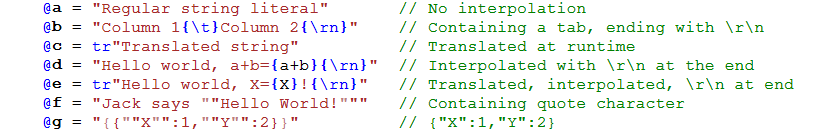

#  Zurfur

Zurfur is is a programming language I'm designing just for fun and enlightenment.
The language is named after our cat, Zurfur, who was named by my son.  It's
spelled **_ZurFUR_** because our cat has fur.

## Overview

I love C#.  It's my favorite language to program in.  But, I'd like to fix
some [warts](http://www.informit.com/articles/article.aspx?p=2425867) and have
some features from other languages built in from the ground up.

#### Design Goals

* Fun and easy to use
* Faster than C# and unsafe code just as fast as C
* Target WebAssembly with ahead of time compilation
* Typesafe replacement for JavaScript
* Stretch goal: Rewrite compiler and IDE in Zurfur on Node.js

Zurfur takes its main inspiration from C#, but borrows syntax and design
concepts from Golang, Rust, Zig, Lobster, and many other languages.
Here are some key features of Zurfur:

* Mutability and nullabilty are part of the type system:
    * References are non-nullable by default and may use `?type` for nullable
    * Function parameters must be explicitly marked `mut` if they mutate anything
    * Children of read only fields (i.e. `ro` fields) are also read only
    * Get/set of a mutable struct acts like you expect (e.g. `myObject.VectorProperty.X = 3` works)
* Functions pass `struct` parameters by reference or value, whichever is more efficient
* Type declaration syntax is from Golang
* Strings are UTF8 byte arrays, always initialized to ""
* Interfaces support Rust style traits and Golang style duck typing
* Clone always performs a deep copy 
* `==` operator fails if it is not defined on a class (does not default to object comparison)
* Async acts like a blocking call without the `await` keyword (ideal for JavaScript callbacks)

#### Status Update

The syntax is still being developed, nothing is set in stone yet.  Feel
free to send me comments letting me know what you think should be changed.

#### Inspirations

* [Lobster](http://strlen.com/lobster/) - A really cool language that uses reference counting GC
* [Zig](https://ziglang.org/) - A better and safer C
* [Pinecone](https://github.com/wmww/Pinecone/blob/master/readme.md) - Inspiration to keep plugging away

## Functions

    /// This is a public documentation comment.  Do not use XML.
    /// Use `name` to refer to variables in the code. 
    pub static fun Main(args Array<str>)
    {
        // This is a regular private comment
        Console.Log("Hello World, 2+2=" add(2,2))
    }

    // Regular static function
    pub static fun add(a int, b int) int
        => a + b

Functions are declared with the `fun` keyword. The type names come
after each argument, and the return type comes after the parameters.
Functions, classes, structs, enums, variables and constants are
private unless they have the 'pub' qualifier.  Functions are allowed
at the namespace level, but must be static or extension methods.

TBD: Still thinking about using the Golang `func` keyword to define functions.

By default, functions pass parameters by immutable reference.  The exception
is that small structs may be passed by value when it is more efficient to do so.

    pub fun Test(a      f64,       // Pass by value since that's more efficient
                 s      MyStruct,  // Pass by value or reference whichever is more efficient
                 ms mut MyStruct,  // Pass by reference, preserve `ro` fields
                 rs ref MyStruct,  // Pass by reference, nothing is preserved
                 os out MyStruct,  // MyStruct is returned by reference
                 c      MyClass,   // Pass reference, the object is immutable
                 mc mut MyClass,   // Pass by reference, object is mutable, reference cannot be changed
                 ic ref MyClass,   // Pass by reference, object is mutable, reference can be changed
                 oc out MyClass)   // MyClass is returned by reference

If `s` is big, such as a matrix containing 16 floats, it is passed by
reference.  If it is small, such as a single float or int, it is passed
by value.  A struct containing two integers might be passed by value or
by reference depending on the compiler, options, and optimizations.

Even if `MyStruct` or `MyClass` is mutable, `s` and `c` cannot be mutated.
Only parameters marked with `mut` or `ref` can be mutated.  `out` parameters
must be assigned, never read.

## Local Variables

Within a function, variables are declared and initialized with the `@` 
operator (i.e. the `var` keyword from C#):

    @a = 3                          // a is an int
    @b = "Hello World"              // b is a str
    @c = MyFunction()               // c is whatever type is returned by MyFunction
    @d = [1,2,3]                    // d is List<int>, initialized with [1,2,3]
    @e = ["A":1.0, "B":2.0]         // e is Map<str,f64>
    @f = [[1.0,2.0],[3.0,4.0]]      // f is List<List<f64>>

The above form `@variable = expression` creates a variable with the same type as
the expression.  A second form `@variable type [=expression]` creates an explicitly
typed variable with optional assignment from an expression.  If the expression
cannot be converted, an error is generated

    @a int = MyIntFunc()                // Error if MyIntFunc returns a float
    @b str                              // b is a string, initialized to ""
    @c List<int>                        // c is an empty List<int>
    @d List<f64> = [1, 2, 3]            // Create List<f64>, elements are converted
    @e Map<str,f32> = ["A":1, "B:1.2]   // Create Map<str,f32>
    @f Json = ["A":1,"B":[1,2,3.5]]     // Create a Json

In general, `@` is used to introduce a variable into the scope of a function,
class, or struct.

An array of expressions `[e1,e2,e3...]` is used to initialize a list and
an array of pairs `[K1:V1,K2:V2...]` is used to initialize a map.  Notice
that brackets `[]` are used for both arrays and maps. Curly braces are reserved
for statement level constructs.  Constructors can be called with `()`.  
The following are identical, although, the simplest form is preferred:

    @a = ["A":1, "B":2]                     // Map<str,int> implied from context
    @b Map<str,int> = ["A":1, "B":2]        // Type name is specified
    @c Map<str,int> = [("A",1), ("B", 2)]   // Use ICollection and KeyValuePair constructor

`a` is prefered for local variables, but can't be used to declare class
variables, so `b` is preferred for creating fields. `c` is not preferred,
but is accepted because the `Map` constructor takes an
`ICollection<KeyValuePair<str,int>>` parameter. The `KeyValuePair` constructor
takes `str` and `int`, so everything matches up and is accepted.

Assuming a `MyPointXY` has a constructor taking two integers and public
mutable fileds named `X` and `Y`, any of these forms could be used.

    @c Map<str, MyPointXY> = ["A": (1,2), "B": (3,4)]           // MyPointXY Constructor
    @d Map<str, MyPointXY> = ["A": (X:1,Y:2), "B": (X:3,Y:4)]   // MyPointXY field initializer
    @a = ["A": MyPointXY(1,2), "B": MyPointXY(3,4)]             // MyPointXY Constructor
    @b = ["A": MyPointXY(X:1,Y:2), "B": MyPointXY(X:3,Y:4)]     // MyPointXY field intitializer

The `@` operator can also be used to capture the result of a sub-expression:

    while stream.Read(buffer)@count != 0
        { result.Push(buffer[0::count]) }

    if myMap.TryGet("MyKey")@value
        { doSometingWith(value) }

#### Non-Nullable References

References are non-nullable (i.e. may never be `null`) and are initialized
when created.  The optimizer may decide to delay initialization until the
variable is actually used which could have implications if the constructor
has side effects.  For instance:

    @myList List<int>               // Optimizer may remove this constructor call
    if MyFunc()
        { myList = MyListFunc() }   // Constructor might not be called above
    else
        { myList.Add(1) }           // Optimizer may move constructor call here

It is possible to create a nullable reference.
    
    @myNullStr ?str         // String is null

A non-nullable reference can be assigned to a nullable, but a
conditional test must be used to convert nullable to non-nullable. 

## Basic types

    i8, u8, byte, i16, u16, i32, int, u32, uint, i64, u64, f32, f64, xint, xuint,
    decimal, object, str, Array<T>, List<T>, Map<K,V>, Span<T>, Json, SortedMap<K,V>

`byte`, `int`, and `uint` are aliases for `u8`, `i32`, and `u32`.
`xint` and `xuint` are extended integer types, which could be 32 or 64 bits
depending on run-time architecture.

**TBD:** Use lower case for `list`, `map`, `json`, `span`, and
other common library class types?  

#### Strings

Strings (i.e. `str`) are immutable byte arrays, generally assumed to hold
UTF8 encoded characters.  However, there is no rule enforcing the UTF8 encoding
so they may hold any binary data.

String literals in source code can start with either a quote `"` or a backtick
`` ` ``, which should only be used when the string literal contains a quote `"`.
They can be translated using `tr"string"` syntax.

They may contain escape constants when they are immediately followed
by `\` and a recognized constant.  For example `"Column 1"\tab"Column 2"`
contains a `\tab` character. Valid escape constants are `\lf` (i.e. `\n` in C),
`\cr` (i.e. `\r` in C), `\crlf`, `\tab`, and others.  Unicode numbers may be
encoded in decimal (e.g. `\127`) or in hexadecimal (e.g. `\x1F600` is the
unicode smiley face).  A `\` inside the quotes is not an escape character.
TBD: Do we want to stick with `\n` and `\r` out of tradition?  I find them
confusing, especially since they aren't marked that way on most ASCII charts.

Strings are interpolated when when followed by parenthesis `"Example:"(expression)`,
or an identifier beginning a primary expression `"Item #" i "=" X[i]`.  

There is no `StringBuilder` class.  Instead, use `List<byte>`. 

    @sb = List<byte>()
    sb.Push("Count to 10: ")
    for @count in 1::10
        { sb.Push(" " count) }
    return str(sb)

Strings can be sliced.  See `List` (below)

#### Array

Zurfur arrays are immutable.  They may contain only immutable classes
explicitly marked with `ro`.  Mutable struct elements are allowed; however,
they are copied into the array and become immutable therever after.
Structs containing mutable classes, such as `List` are not allowed.

Arrays, like strings, should be used to hold data that never changes
after it has been created.  Use `List` to build and hold mutable data,
use `Array` to store immutable data.

    struct MutStruct {pub @value int}
    class ro ImmutClassGood { pub ro @value int}
    class ImmutClassBad { pub ro @value int }
    a = [1,2,3]                             // mutable List<int>
    b = Array(a)                            // Array<int>, immutable elements copied from a
    c = Array([MutStruct(value:1)])         // Array<MutSruct>, elements are copied then become immutable
    d = Array([ImmutClassGood(value:1)])    // Immutable classes are allowed in an array
    e = Array([ImmutClassBad(value:1)])     // Illegal, class must marked `ro`

Arrays can be sliced.  See `List` (below)

**TBD:** In the future, the requirement for requiring `ro` on all class elements
could be lifted provided that the class is cloned at array creation time.

#### Span

Span is a view into a string, array, or list.  They are `ref struct` and
may never be put on the heap.  The span itself is immutable, and cannot be
copied.  It can be returned from a function, but absolute single ownership
is enforced. This allows a `Span` to have a deterministic destructor.
More on this in on the GC section below.

Elements are immutable when `str` and `Array` are sliced, and mutable when
`List` is sliced. See `List` (below) for more info on slicing

#### List

`List` is a variable sized array with a `Count` and `Capacity` that
changes as items are added or removed.  Lists use `ref` returns and act
exactly like a dynamically sized mutable array.

    @a = [1,2,3]                // a is List<int>
    @b = ["A", "B", "C"]        // b is List<str>
    @c = [[1,2,3],[4,5,6]]      // c is List<List<int>>

A field of a mutable struct can be modified, like so:

    struct MyPoint { pub X int;  pub Y int; fun new(x int, y int) {todo()} }
    @a List<MyPoint> = [(1,2),(3,4),(5,6)]  // Use array intializer with MyPoint constructor
    a[1].Y = 12                             // Now a contains [(1,2),(3,12),(5,6)]

Given a range, the index operator can be used to slice the List.  A slice is a view
into the list.  A change to the list is a change to the span and a change to the
span is a change to the list.

    @a = ["a","b","c","d","e"]  // a is List<str>
    @b = a[1..4]                // b is a span, with b[0] == "b" (b aliases ["b","c","d"])
    @c = a[2::2]                // c is a span, with c[0] == "c" (c aliases ["c","d"])
    c[0] = "hello"              // now a = ["a","b","hello","d","e"], and b=["b","hello","d"]

When the count or capacity of a list changes, all spans pointing into it become detached.
A new list is created and used by the list, but the old spans continue aliasing the old
data.  In general, this should be very rare for most programs, however it is necessary
for memory safety, efficiency, and programmers should be aware.  **TBD:** May panic
instead of detaching, since this is probably a programming error.

        @list = List<byte>()
        list.Push("Hello Pat")  // list is "Hello Pat"
        @slice = a[6::3]        // slice is "Pat"
        slice[0] = "M"[0]       // slice is "Mat", list is "Hello Mat"
        list.Push("!")          // slice is now detached, list is "Hello Mat!"
        slice[0] = "C"[0]       // slice is "Cat", list is still "Hello Mat!"

#### Map

`Map` is a hash table and is similar to `Dictionary` in C#.

    @a = ["Hello":1, "World":2]     // a is Map<str,int>
    @b = a["World"]                 // b is 2
    @c = a["not found"]             // throws exception
    @d = a.Get("not found")         // d is 0
    @e = a.Get("not found", -1)     // e is -1

#### SortedMap

This will be similar to `Map`, but use a red black tree.

#### Json

`Json` is the built in Json object with support communication with JavaScript.  
Using an invalid key does not throw an exception, but instead returns a default
empty object.

    @a Json = ["Hello":1, "World":2]
    @b = a["World"]                         // b is Json(2), not an int
    @c = a["World"].Int                     // c is 2
    @d = a["World"].Str                     // d is "2"
    @e = a["not found"]["?"].int            // e is 0

The `Json` data structure is meant to be quick and easy to use, not necessarily
the fastest or most efficient. For efficient memory usage, `Json` will support
[Newtonsoft](https://www.newtonsoft.com/json) style serialization:

Another example:

    @a Json = [
        "Param1" : 23,
        "Param2" : [1,2,3],
        "Param3" : ["Hello":12, "World" : "Earth"],
        "Time" : "2019-12-07T14:13:46"
    ]
    @b = a["Param1"].Int            // b is 23
    @c = a["param2"][1].Int         // c is 2
    @d = a["Param3"]["World"].Str   // d is "Earth"
    @e = a["Time"].DateTime         // e is converted to DateTime
    a["Param2"][1].Int = 5          // Set the value

## Operator Precedence

Operator precedence comes from Golang.

|Operators | Notes
| :--- | :---
|x.y  f<type>(x)  a[i] | Primary
|- ! & ~ * sizeof use unsafe cast| Unary
|@|Capture new variable
|as is | Type conversion and comparison
|* / % & << >>| Multiply/Bits
|+ - &#124; ~| Add/Bits
|Low..High, Low::Count|Range (inclusive of low, exclusive of high)
|== != < <= > >= === !== in|Not associative
|&&|Conditional
|&#124;&#124;|Conditional
|a ? b : c| Not associative (see below for restrictions)
|->|Lambda
|key:Value|Pair
|,|Comma Separator (not an expression)
|= += -= *= /= %= &= |= ~= <<= >>=|Assignment Statements (not an expression)
|=>|Statement Separator

The `~` operator is both xor and unary complement, same as `^` in Golang.

The `@` operator captures the expression into a new variable.
For instance `while stream.Read(buffer)@length != 0 {...}`
captures the value returned by `Read` into the new variable `length`.
Or, `if maybeNullObjectFunc()@nonNullObject { }` can be used to
convert `?Object` into `Object` inside of the braces. 

The range operator`..` takes two `int`s and make a `Range` which is a
`struct Range{ High int; Low int}`.  The `::` operator also makes a
range, but the second parameter is a count (`High = Low + Count`).  

The pair operator `:` makes a key/value pair which can be used
in an array to initialize a map.

Assignment is a statement, not an expression.  Therefore, expressions like
`a = b = 1` and `while (a = count) < 20` are not allowed. In the latter
case, use `while count@a < 20`.  Comma is also not an expression and may
only be used where they are expected, such as a function call or lambda.

Operator `==` does not default to object comparison, and only works when it
is defined for the given type.  Use `===` and `!==` for object comparison. 
Comparisons are not associative, so `a == b == c` is illegal.

The ternary operator is not associative and cannot be nested.  Examples
of illegal expresions are `c1 ? x : c2 ? y : z` (not associative),
`c1 ? x : (c2 ? y : z)` (no nesting).  The result expressions may not
directly contain an operator with lower precedence than range.
For example, `a==b ? x==3 : y==4` is  illegal.  parentheses can be
used to override that behavior, `a==b ? (x==3) : (y==4)` and
`a==b ? (p-> p==3) : (p-> p==4)` are acceptable.

#### Operator Overloading

`+`, `-`, `*`, `/`, `%`, and `in` are the only operators that may be individually
defined.  The `==` and `!=` operator may be defined together by implementing
`static fun Equals(a myType, b myType) bool`.  All six comparison operators,
`==`, `!=`, `<`, `<=`, `==`, `!=`, `>=`, and `>` can be implemented with just
one function: `static fun Compare(a myType, b myType) int`.  If both functions
are defined, `Equals` is used for equality comparisons, and `Compare` is used
for the others.

Overloads using the `operator` keyword are static.  Only static
versions of `Equals` and `Compare` are used for the comparison operators.
Zurfur inherits this from C#, and Eric Lippert
[gives a great explanation of why](https://blogs.msdn.microsoft.com/ericlippert/2007/05/14/why-are-overloaded-operators-always-static-in-c).

## Mutability

I have some info sprinkled around, but this is where I will consolidate.
The short version: More explicit than C#, easier than Rust.

Read only `ro` means children classes are also read only.  A `ro`
return from a function prevents the calling function from mutating.

**TBD:** Add more info here.

## Statements

Like Golang, semicolons are required between statements but they are automatically
inserted at the end of lines based on the last non-comment token and the first token
of the next line.  See "Coding Standards" (below) for more info about semi-colons.

#### While and Do Statements

The `while` loop is the same as C#.  The `do` loop is also the same as C#
except that the condition executes inside the scope of the loop:

    do 
    {
        @accepted = SomeBooleanFunc()
        DoSomethingElse()
    } while accepted

#### Scope Statement

The `scope` statement creates a new scope:

    scope
    {
        @file = use File.Open("My File")
        DoStuff(file)
    }
    // File variable is out of scope here

The `scope` statement can be turned into a loop using the `continue` statement:

    scope
    {
        DoSomething()
        if WeWantToRepeat()
            { continue }
    }

Likewise, `break` can be used to exit early.

#### For Loop

For the time being, `for` loops only allow one format: `for @newVariable in expression`. 
The new variable is read-only and its scope is limited to within the `for` loop block.
The simplest form of the for loop is when the expression evaluates to an integer:

    // Print the numbers 0 to 9
    for @i in 10
        { Console.WriteLine(i) }   // `i` is an integer

    // Increment all the numbers in an list
    for @i in list.Count
        { list[i] += 1 }

The range operators can be used as follows:

    // Print the numbers from 5 to 49
    for @i in 5..50
        { Console.WriteLine(i) }   // `i` is an integer

    // Print all the numbers in the list except the first and last
    for @i in 1..list.Count-1
        { Console.WriteLine(list[i]) }

    // Collect elements 5,6, and 7 into myArray
    for @i in 5::3
        { myList.Add(myArray[i]) }

Any object that supplies an enumerator (or has a `get` indexer and a `Count` property)
can be enumerated.  The `Map` enumerator supplies key value pairs:

    // Print key value pairs of all elements in a map
    for @kv in map
        { Console.WriteLine("Key: " + kv.Key.ToString() + " is " + kv.Value.ToString()) }

The expression after `in` is evaluated at the start of the loop and never
changes once calculated:

    // Print the numbers from 1 to 9
    @x = 10
    for @i in 1..x
    {
        x = x + 5               // This does not affect the loop bounds 
        Console.WriteLine(i)
    }

When iterating over a collection, just like in C#, it is illegal to add
or remove elements from the collection.  An exception is thrown if
it is attempted.  Here are two examples of things to avoid:

    for @i in myIntList
        { myIntList.Add(1) }   // Exception thrown on next iteration

    // This does not remove 0's and increment the remaining elements
    // The count is evaluated only at the beginning of the loop.
    for @i in myIntList.Count
    {
        if myIntList[i] == 0
            { RemoveAt(i) }        // There are at least two problems with this
        else
            { myIntList[i] += 1 } // This will throw an exception if any element was removed
    }
 
#### Switch

The switch statement is mostly the same as C#, except that a `case` statement
has an implicit `break` before it.  `break` is not allowed at the same
level as a `case` statement.

    switch expression
    {
    case 0, 1, 2:
        DoStuff0()  // No fall through here.
    case 3..6:      // Same as 3,4,5
        DoStuff1()
        break;      // SYNTAX ERROR: Break is illegal here
    case 6,7,8:
        DoStuff2()
        if x==y
            { break }  // Exit switch statement early, don't DoStuff3
        DoStuff3()
    default:
    }

**TBD:** `default` required unless all cases covered.

#### Match

The `match` keyword is reserved, but the syntax is identical to a regular function call.

    @num = 3 + match(myConstant)[1:a, 2..5:b, 6:myFunc(), default: 0]

## Coding Standards

Zurfur enforces a few coding standards, but one style it does **not** enforce
where your curly brace goes.  Both end-of-line and beginning-of-next-line are
acceptable.  By convention, all code in the Zurfur code base uses curly brace
on beginning-of-next-line style.  The Zurfur IDE shrinks curly brace only lines
so they take the same space as the brace-at-end style as in a regular IDE.

Here are the enforced coding standards:

1. No tabs in the source code
2. No white space at end of line
3. No semi-colons at the end of lines
4. Split lines require a binary operator at the beginning of the next line
5. Or split lines require `[`, `(`, or `,`, on the previous line

Like Golang, semicolons are required between statements but they are automatically
inserted at the end of lines based on the last non-comment token and the first token
of the next line.

The general rule is that any line beginning with a binary operator does not put
a semicolon on the previous line.  Additionally, `{`, `[`, `(`, or `,` at the end
of a line prevents a semicolon on that line.

**Exception:** A line beginning with an `*` always has a semicolon before it, so
multiplication cannot be used to continue a line.  This is necessary so a
dereference statement such as `*a = 3` cannot be continued from the previous line.

## Class, Struct, and Enum

Class and struct are similar to C# in that class is a heap reference object
and struct is a value object.

    pub class Example
    {   
        // Mutable fields
        F1 str                                  // Private string initialized to ""
        pub F2 List<int>                        // List initialized to empty (i.e. Count = 0)
        pub F4 List<int> = [1,2,3]              // List initialized with 1,2,3
        pub F5 List<str> = ["Hello", "World"]   // Initialized list
        pub F6 Map<str,int> = ["A":1, "B":2]    // Initialized map

        // Immutable fields
        pub ro F7 str = "Hello world"
        pub ro points List<MutablePointXY> = [(1,2),(3,4),(5,6)]
        
        pub fun Func1(this, a int) f64 => "" F1 " hi"   // Member function
        pub fun Func2(this mut, a int) { F1 = "x"}      // Member function that mutates

        pub prop Prop1 str => F1                        // Property returning F1
        pub prop ChangedTime DateTime = DateTime.Now    // Default value and default get/set
            => default get private set
    }

Class fields can use `ro` to indicate read only.  Unlike in C#, When `ro`
is used, the children are also read onyl (e.g. `points[1].x = 0` is illegal)

The `prop` keyword is used to define a property.  Properties can be given
a default value by `=` immediately after the type name.  The compiler can
auto implement them with `=> default` followed by `get` and optionally `set`.
Or you can implement them the regular way `prop GetExpr { get { return expression } }`

Classes are sealed by default.  Use the `unsealed` keword to open them up.
Sealed classes may be extended but no functions may be overridden.

**TBD:** Require `@` for field definitions?  Consider requiring `var` keyword instead.

#### Struct

Struct is a value object, and can be used where speed and
efficiency are desired.  `int`, `byte`, and `float` are structs. 

    // Mutable point (each mutable function must also be marked)
    pub struct MyMutablePoint
    {
        pub X int
        pub Y int
        pub fun new(x int, y int) { X = x; Y = y}
        pub mut fun SetY(y int) { Y = y }
        pub prop PropX int { get => X; set { X = value } }
    }
    
A mutable struct returned from a getter can be mutated in-place provided there is a corresponding setter.

    @a = List<MyMutablePoint> = [(1,2), (3,4), (5,6)]
    a[1].X = 23         // a contains [(1,2),(23,4), (5,6)]
    a[1].SetY(24)       // a contains [(1,2),(23,24), (5,6)]
    a[1].PropX = 0      // a contains [(1,2),(0,24), (5,6)]

This works because `SetY` is a mutating function so the corresponding
`List` setter is called to save the result. 

Structs are mutable by default, but can be made immutable using the `ro` keyword:

    // Immutable point (use `ro` on the `struct`)
    pub struct ro MyPoint
    {
        pub ro X int
        pub ro Y int
        pub new(x int, y int) { X = x; Y = y}
    }

They are passed to functions by value or by reference, whichever is more
efficient.  So, `@a = Multiply(b,c)` would pass `b` and `c` by value
if they are integers, or by reference if they are large matricies.

They can be initialized by a constructor or using named field parameters:

    @a = MyPoint(1,2)
    @b = MyPoint(X: 3, Y: 4)

**TBD:** Make `struct` members public by default?

#### Anonymous Class and Struct

An anonymous class can be created like this: `@a = class(x int, y int)`
or `@a = class(x=1, y=MyFunc())`.  Fields are public, and do not need
explict type names when used as a local variable.

Since struct parameters of a lambda are passed by read-only value, an
anonymous class can be used to capture them by reference.

    @a = class(max = int.Min)
    myList.ForEach(item -> { a.max = Math.Max(item, a.max) })
    Log.Info("Maximum value in the list is: " a.max)
    
For now, anonymous struct is the only way to return multiple values
from a function.

    pub static fun Circle(a f64, r f64) struct(x f64, y f64)
        => (r*Cos(a), r*Sin(a))

    @a = ReturnTwoValues(PI/2, 1.0)
    Log.Info("My two values are x=" a.x ", and y=" a.y)

#### Enums

Enumerations are similar to C# enumerations, in that they are just
a wrapped `int`.  But they are implemented internally as a `struct`
and do not use `,` to separate values.

    pub enum MyEnum
    {
        A           // A is 0
        B; C        // B is 1, C is 2
        D = 32      // D is 32
        E           // E is 33
    
        // Enumerations can override ToString
        override fun ToString() => MyConvertToTranslatedName()
    }

The default `ToString` function shows the value as an integer rather
than the name of the field, but it is possible to override and make it
display anything you want.  This allows enumerations to be just as light
weight as an integer and need no metadata in the compiled executable.

**TBD:** Differentiate an enum having only scalar values vs one with flags?
The one with flags allows `|` and `&`, etc but the other doesn't.

## Interfaces

Interfaces are a cross between C#, GoLang, and Rust, but a little different
from each.  They are similar to C# 8.0 (including default implementations, etc.)
but also allow Golang style *explicit* conversion from any class that defines
all the required functions.

Here is `IEquatable<T>` from the standard library:

    pub static interface IEquatable<T>
    {
        static fun GetHashCode(a T) uint => imp
        static fun Equals(a T, b T) bool => imp
    }

Unimplemented functions and properties are explicitly marked with
`imp`.   Functions and properties must either have an implementation or
specify `imp`, `default`, or `extern`.  

NOTE: The implementation will use fat pointers.

**TBD:** Describe syntax for creating externally defined traits, like
in Rust.  For example `implement TRAIT for TYPE`

#### Structural Typing

In C#, a class must explicitly support an interface.  This is good because
it forces the class designers to consider the supported interfaces when
making API changes.  Golang will convert any class to an interface as long
as the class implements all the matching functions.  This is convenient, but
there is no contract forcing the class designer to think about each supported interface. 
[Some people don't seem to like this too much.](https://bluxte.net/musings/2018/04/10/go-good-bad-ugly/#interfaces-are-structural-types)

Zurfur takes the middle ground.  Classes should list the interfaces they
support.  But, an *explicit* cast can be used to build any interface provided
the class implements all the functions.  The explicit cast is to remind us
that the class does not necessarily support the interface, and it's on the
user (not the library writer) to make sure it's all kosher.

#### Conversion Back to the Concrete Class

A base class can be cast to a derived class, but it is impossible* to cast
an interface back to its concrete class.  This prevents people from "fishing"
around to get at the concrete class.  Can you believe people actually do that?
Please don't look at my code :)

* Impossible in safe code that is.  Unsafe code can get at the underlying pointer.

#### Static Interfaces and Functions

Interfaces may include static functions.  Static functions are
a better fit than virtual functions for some operations.
For instance,  `IComparable` has only static functions.  This is
because, when you want to know if `a >= b`, it doesn't make sense
to ask `a` (via virtual function dispatch) to compare itself to `b`
which could be a different type.  What does it mean if they are
different types?  `a` wouldn't know what `b` is.  Note that `a`
and `b` can still be different types as long as the base class
implements `IComparable`, but the comparison function is on the
base class, not the derived classes.

`IArithmetic` is a static only interface, allowing this generic
function:

    // Return `value` if it `low`..`high` otherwise return `low` or `high`.  
    pub static fun BoundValue<T>(value T, low T, high T) T
            where T is IAritmetic
    {
        if value <= low
            { return low }
        if value >= high
            { return high }
        return value;
    }

#### Implementation Note

An interface is implemented using a fat pointer containing a reference to a VTable
and a reference to the object.  There is very little overhead calling an interface
method (less than calling a virtual function), but there is a little more overhead
casting an object to an interface.

See [Interface Dispatch](https://lukasatkinson.de/2018/interface-dispatch/)
and scroll down to *Fat Pointers*.  A comment by Russ Cox explains why
this is a good design choice "*The key insight for Go was that in a statically
typed language, type conversions happen far less often than method calls, so doing
the work on the type conversion is actually quite cheap.*"

Note that an interface containing only static functions can be implemented using
a thin pointer.

## Errors and Exceptions

Errors are return values which can be caught, stored, or explicitly ignored.
Exceptions are programming errors that stop the debugger and complain loudly.
They cannot be caught, however, they are memory safe and do enough cleanup
so that a production system can log the error and continue running. (i.e.
they actually can be caught in special places, but never in synchronous code)

A function marked with `error` may either return a result or return an error.
If the result is used without error checking, either 1) the function must have
an error handler, or 2) the function must have an error return value, or 3) both.

Any scope can catch an error.  Given the following definitions:

    pub fun afun Open(name str, mode FileMode) File error => impl
    pub mut afun Read(data mut Span<byte>) int error  => impl
    pub mut afun Close() error => impl

We may decide to let errors percolate up:

<pre>
    pub afun ReadFileIntoString(name str) str <b>error</b>
    {
        @result = List<byte>()
        @buffer = List<byte>(256, byte(0)) // Fill with 256 0 bytes
        @stream = <b>use</b> File.<b>Open</b>(name, FileMode.ReadOnly)
        while stream.<b>Read</b>(buffer)@count != 0
            { result.Push(buffer[0::count]) }
        return str(result)
    }
</pre>
    
There are 3 functions that can generate an error, `use`, `Open`, and `Read`.
They are highlighted by the IDE to let you know each one could immediately
generate an error and exit the function.  If the function were not marked
`error`, the code would fail to compile.  But we could handle those errors
in the function instead percolating them up.

<pre>
    // This is not an example of something that should be done
    pub afun ReadFileOrErrorIntoString(name str) str // not marked with `error`
    {
        @result = List<byte>();
        @buffer = List<byte>(256, byte(0))
        @stream = <b>use</b> File.<b>Open</b>(name, FileMode.ReadOnly)
        while stream.<b>Read</b>(buffer)@count != 0
            { result.Push(buffer[0::count]) }
        return str(result);
    error e FileNotFound:
        return "ERROR: Can`t even open the file, " e.Message
    error e:
        return "ERROR: Can't read the file, " e.Message ", here is part of it: " str(result)
    }
</pre>

A scope can have only one error handler at the end of it, but it may have
multiple error cases.  Any un-tested error jumps directly to it.  It has
access to only the variables declared before the first un-caught error.
In this case it has access to `result` and `buffer`, but not `stream`.

An error handler at the end of a function requires the use of `return` above
it, even if the function is void.  Each case of the error handler must terminate
with either `return` to suppress the error or with `raise` to percolate the
error up.  Only when the final error case catches all errors (i.e. `error e:`)
and also `return`'s, can the the error be fully suppressed and the
function not marked with `error`.

Error handlers nested inside a scope must use `return`, `break`, or `continue`

**TBD:** Figure out how to test for an error instead of catching it.
Maybe `if try(File.Open(...)@stream) { use stream... }`  The above is still a WIP
[Midori](http://joeduffyblog.com/2016/02/07/the-error-model/)

## Garbage Collection

**TBD:** Explain how `ref` structs can have an `unsafe` deterministic
destructor and how that will help with garbage collection.

There will be a garbage collector, but probably 99% of the garbage can be
deleted right after it is created, used, and forgotten.  For instance:

    pub afun WriteStuffToFile(fileName str) error
    {
        @buffer = List<byte>()
        for @i in 1::10
            { buffer.Push("Count = i" i ""/crlf) }
        @stream = use File.Open(fileName, FileMode.Create)
        stream.Write(buffer)
    }

The compiler can see into all functions and know that `Push` doesn't
capture its arguments, nor do any of the internal functions used
to convert integers to strings or other internal functions for
interpolating strings.  Therefore, the compiler can delete each temporary
object in the `for` loop at the end of the scope of each iteraton.
It can also see that `stream` can't escape (because it can look into the
`Open` function and see it's never captured) and delete it at the
end of the function.  

`buffer` is sliced to create a `Span` which is a `ref` struct that can
only be captured for the duration of the async call.  Using some light
weight reference counting, all of the arrays used to build the `buffer`
can be deleted as the buffer is expanded.  There are a few exceptions
where the underlying array can be leaked but those can't happen in this
example and should be rare in well written programs, see `list` (above)
for how the span can become detached.

In Zurfur, calling an async function doesn't create a heap object, so there
is no garbage created for them.

The first version of Zurfur uses reference counting only for the array
underlying the list.  All other objects are deterministically destroyed
when they can be, and garbage collected when the compiler can't prove
that it's ok to do so.
Thanks to [Lobster](https://aardappel.github.io/lobster/memory_management.html)
and the single threaded nature of JavaScript I have decided that it is
OK to use reference counting for some things.  Given WebAssembly, memory safety,
and efficiency, I think we will need a garbage collector for now.

A future version of Zurfur might have reference counting for all objects,
or it might have a compacting collector.

## Pointers

The unary `*` operator dereferences a pointer.  The `.` operator is used to access fields
or members of a pointer to the struct (so `->` is not used for pointers, it is only for lambdas). 
 
    pub static fun strcpy(dest *byte, source *byte)
    {
        while *source != 0
            { *dest = *source;  dest += 1;  source += 1 }
        *dest = 0
    }

#### Pointer Safety

For now...

Pointers are not safe.  They act axactly as they do in C.  You can corrupt
memory and crash your application.  They can be null, and the compiler
does not add run time null checks.  There are three reasons for this.

First, it makes porting from C easier.  I need to port DlMalloc without
worrying about pointer type safety.  Second, they are fast.  It is
necessary to have low level libraries and infrustructure running
fast and efficiently.  Third, without pointers, Zurfur is a type
safe language.  Pointers should only be used where necessary.

Perhaps, after Zurfur is running, I might add a few things from
[Zig](https://ziglang.org/).  Among them is null safety (e.g. `*?int`)
and requiring an array type to allow array access (i.e. `*[]int`).
That would be a major breaking change, which might be acceptable if
done before version 1.0.  But, speed cannot be sacrificed.

Pointers are never tracked by the GC.  Any object that may have a
pointer pointing into it must be pinned.

In an unsafe context, pointers can be cast from one type to another
using the `cast` operator.  The format is `cast(type)expression`.
For those coming directly from C, it will look almost the same
as an old C style cast, except the keyword `cast` must be used.

    @b = cast(*int)myFloatPtr   // Cast myFloatPtr to *int

## Namespaces

Namespaces are similar to C#, but can also contain static functions,
and extension methods.  `using Zurur.Math` imports the intrinsic
math functions, `Cos`, `Sin`, etc. into the global symbol table.  If you
want to froce them to be prefixed with `Math.`, it can be done with
`using Math=Zurfur.Math`.

The first namespace defined in a file does not use curly braces to start a
new scope, nor should it start a new level of indentation.  All other
namespaces are sub-namespaces of the top level namespace and must
use curly braces.  Only one top level namespace per file is allowed.

## Async

Golang's concept of async is awesome.  Everything should be async by
default, but look as if it were sync. 

The problem with this approach is that WebAssembly doesn't support
the same kind of stack switching used by Golang. It would be difficult
to optimize function calls through a delegate that may or may not be
async.  One of the goals of Zurfur is that it be as fast and efficient
as C, so this is too high a price to pay.

For the time being, async is built into the type system but it looks and
acts as if it were sync.  Calling an async function from async code blocks
without using the `await` keyword:

    afun MySlowIoFunctionAsync(server str) str 
    {
        // In C# `await` would be needed before both function calls
        @a = MakeXhrCallToServerAsync(server)    // Blocks without await keyword
        Task.Delay(100);                            // Also blocks without a keyword
        return a;
    }

Notice that async functions are defined with the `afun` keyword.

Async code normally looks and acts as if it were sync.  But, when we want
to start or wait for multiple tasks, we can also use the `astart` and
`await` keywords.

    afun GetStuffFromSeveralServers() str 
    {
        // Start the functions, but do not block
        @a = astart { MySlowIoFunctionAsync("server1") }
        @b = astart { MySlowIoFunctionAsync("server2") }
        @c = astart { MySlowIoFunctionAsync("server3") }

        // The timeout cancels the task after 10 seconds, but we'll hand
        // the task to the user who may push a button to cancel early
        // TBD: Timeouts and cancellation are still TBD
        @timeout = astart Task.Delay(10000); 
        GiveThisTaskToAUserWhoCancelTheOperationEarly(timeout)

        // Collect the results in the order they complete order
        @sum = new list<str>()
        await a, b, c, timeout
        {
            case a.HasResult: sum += a.Result
            case b.HasResult: sum += b.Result
            case c.HasResult: sum += c.Result
            case a.HasException: sum += "a failed"   // It threw an exception but swallow it and continue
            case b.HasException: sum += "b failed"   // Cancel remaining tasks and exit immediately
            case timeout.HasResult: break            // 10 seconds has passed, cancel automatically
            case timeout.HasException: break         // The user has canceled the operation early
            // TBD: break cancels all remaining tasks
            // TBD: If `c` throws, all remaining tasks are canceled.
        }
        // TBD: The only way to get out of an `await` is when all of the awaited
        // tasks have completed completed (possibly with an exception)

        // Not strictly necessary, but TBD good practice? 
        // TBD: Make sure Task functions can use `FinalizeNotify` to clean up
        timeout.Cancel()
    }

A sync function cannot implicitly call an async function, but it can start it
using the `astart` keyword, like this: `fun MySyncFunction() { astart MyAsyncFunction() }`

#### Async Implementation 

Async will be implemented with an actual stack, not with heap objects. 
This should improve GC performance since each task call won't be
required to create a heap allocation.  Stacks themselves won't be
GC objects.  Instead there will be a reusable list of stack arrays.

#### Async by Default?

Should everything be async by default? The compiler can figure out if a
function needs to be async, and can optimize most sync code into sync
functions.  There are two problems here.

First, the compiler would have trouble optimizing lambda function calls.
If `List<T>.Sort(compare fun(a T, b T) bool)` is compiled
as async, it would be an efficiency disaster.

Second, it would be far to easy for a function to *accidentally* be changed
from sync to async.  Imagine the consequences of changing `malloc` or `new`
to async.  A library that was previously sync and fast could all of a sudden
become async and slow without even realizing it was happening.

One solution could be to mark functions `sync`, something like
`List<T>.Sort(compare sfun(a T, b T) bool)`.  This seems almost as bad
as marking them async.  Are there better solutions?

## Threading

The first version of Zurfur is targeted at replacing JavaScript, and
will not support multi-threading except through web workers.

#### Discussion

It's hard to do multi-threading with speed and memory safety.
Once we drop multi-threading, we can make things fast and
memory safe:

* Interfaces can be implemented with fat pointers that won't tear
* Spans can be stored on the heap, also without tearing
* Garbage collection can use reference counting without an interlock

JavaScript has done pretty well with the single threaded model.
IO is async and doesn't block.  Long CPU bound tasks can be
offloaded to a web worker.  Even Windows uses a single threaded
model for user interface objects.

TBD: Mutable static data is not allowed.  This allows us to safely
add threads in the future since there won't be any way for a function
to have access to mutable data used by another thread.

## Open Questions

Should NAN`s compare the way IEEE numbers are supposed to? Since this is a new
language, my preference would be to have them compare so NAN != NAN and they
sort so NAN > INF.  This way we don't have to worry about doing special
things for Map or sorted collections.  OTOH, it could be confusing when
porting code from other places.  OTOOH, I've had plenty of problems with
the IEEE comparison behavior as it is.

