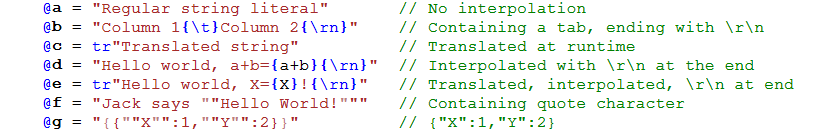

# Zurfur

I love C#. It's my favorite language to program in. But I'd like to have some features from other
languages built in from the ground up. I'm thinking about ownership, immutability, nullability,
and functional programming.

Zurfur is a programming language I'm designing for fun and enlightenment. The language is named
after our cat, Zurfur, who was named by my son.  It's spelled **_ZurFUR_** because our cat has fur.
The syntax is still being developed and nothing is set in stone.  If you want to try it, click 
here https://gosub.com/zurfur

Documentation:

* [Ownership Model](Doc/ownership-model.md): How ownership, mutability, and the type
  system work together in Zurfur.
* [Multi-Threading](Doc/multi-threading.md): Why Zurfur starts single-threaded and
  how true multi-threading will be added in the future.
* [Runtime Model](Doc/runtime-model.md): How the first version of Zurfur will manage memory.

I'm also working on [Zurfur Gui](https://github.com/gosub-com/ZurfurGui), which
you can see here https://gosub.com/zurfurgui.

Older documentation on
[Confluence](https://zurfur.atlassian.net/wiki/external/ZjJlYjUwZmIzMzg0NGJkY2ExMmJlY2MwNDVlNTU4ODU)

## Design Goals

Zurfur takes its main inspiration from C#, but borrows syntax and design
concepts from 
[Lobster](https://strlen.com/lobster/), 
[Zig](https://ziglang.org/), 
[Midori](https://joeduffyblog.com/2016/02/07/the-error-model/), 
Golang, Rust, Python, JavaScript, and other languages.

* **Prime directives:**
    * Fun and easy to use.
    * Faster than C# and unsafe code just as fast as C.
    * Target WebAssembly in the browser with easy JavaScript interop.
* **Ownership, mutability, and nullability are part of the type system:**
    * `ro` means read-only *all the way down*, not like C# where `readonly` protects only the top level.
    * All types are values (i.e. *owned*) except for `ro` types (e.g. `Str`), pointers (`^T`) and borrowed references (`&T`).
    * All mutable types have a `ro` counterpart which can be copied quickly via single pointer assignment (e.g. `Str` and `ro List<Byte>`).
    * Function parameters must be explicitly marked `mut` if they modify anything.
    * Borrowed references may survive async suspension, but structurally invalidating operations on `List` require uniqueness while outstanding borrows exist.
    * References and pointers are non-nullable, but may use `?T` for nullable.
* **Fast and efficient:**
    * Return references and span used everywhere. `[]Int` is `Span<Int>`.
    * Functions pass parameters by reference, but will pass a copy when it is more efficient.
    * Explicit `copy` required when copying an object that requires dynamic allocation.

## Types

Types fall into the basic categories of `struct`, `data`, `object`, and `interface`.  Data types can
be subdivided into `enum` and `flags`.  Finally, there are type attributes, such as `ro`, `box`, and 
`ref` which can be applied to types to change their behavior. For a deeper understanding of these types,
review the [Ownership Model](Doc/ownership-model.md)

| Type | Description
| :--- | :---
| struct | `type struct` can be trivially copied, bit for bit, and may not contain heap allocated data structures of any kind, including `data`, `object`, or `interface` types.  
| data | `type data` may hold mutable or immutable data.  It should act like data, must be copyable, and the compiler will generate a `ro` counterpart which should have proper semantics. Private data is generally not used, except for caching. It may not contain an `object` or `interface` type.
| object | `type object` is expected to contain mutable hidden data.  It does not have a `ro` counterpart, does not need to be copyable nor have an `==` operator.  An object type is stored in-line in memory and obeys the ownership rules as data types (i.e. it's not a reference type like in C#).
| enum | `type enum` is a discriminated union, similar to Rust's `enum`.
| flags | `type flags` is similar to C#'s `enum`.  Flags take a numeric type parameter like `type flags<Byte>` or `type flags<Int>` to hold typed constants.
| interface | `type interface` is a set of functions that can be implemented by any type.  It is similar to Golang's interfaces (i.e. duck typed), but with support for default implementations.
| ro | A `ro` type means it's read only.  This can be used at the type declaration `type ro data MyType` or at the variable declaration `ro List<Int>`.
| box | A `box` stores its data on the heap.  It can be used at the type declaration `type box data MyType` or at the variable declaration `List<box MyType>`.
| ref | A `ref` type is the only type that can contain a reference.  It is restricted to being owned by the stack.

### Basic Types
The ones we all know and love:

    nil, Bool, I8, Byte, I16, U16, I32, U32, Int, U64, F32, Float, Str

`Int` and `Float` are 64 bits wide.

| Type | Description
| :--- | :---
| List\<T\> | Resizable mutable list of elements. `ro List\<T\>` is the immutable counterpart. Structural mutations such as append/remove may require `unique` if there are outstanding borrowed views into the list.
| Span\<T\> | A view into a `List`.  It has a constant length.  Mutability of elements depends on usage (e.g Span from `ro List` is immutable, Span from `List` is mutable)
| Map<K,V> | Unordered mutable map.  `ro Map<K,V>` is the immutable counterpart. 
| Maybe\<T\> | Identical to `?T`.  Always optimized for pointers and references.
| Result\<T\> | Same as `!T`. An optional containing either a return value or an `Error` interface.
| Error | An interface containing a `message` string and an integer `code`
| Str | Strings are an immutable list of bytes with support for UTF-8, similar to how [Golang](https://go.dev/blog/strings) strings.

All types have a compiler generated `ro` counterpart which can be copied very quickly since cloning
them is just copying a reference without dynamic allocation.

## Interfaces

Interfaces use Golang style structural typing.  For now, interface tables are created at compile time,
based only on the functions defined in the same module as the type.  This restriction might be removed
in the future, allowing interfaces to be satisfied by functions defined at the call site.

Interface to interface conversion is a form of reflection, and will not be supported except via reflection.
But, in that case, the result could be different than expected since the interface might have been implemented
in code outside the module the type was defined in.

Interfaces will support default implementations.  Interfaces will not support functions with generic parameters.

## Inheritance is not Supported

Modules and extension methods are used to organize code. Interfaces and lambdas are used for dynamic
dispatch.  Unions (i.e. sum types) are used for small well defined hierarchies.  Type and interface
embedding can be used to "include" a base type in another type using composition.  Golang doesn’t need
inheritance, and neither does Zurfur.

## Syntax 

### Whitespace and Offside Rule

Zurfur uses significant whitespace for scope definition with strict, deterministic rules. Exactly four
spaces per indentation level are required, with tabs forbidden. Curly braces are reserved for explicit
scope boundaries (and interpolated strings) and provide an escape hatch when indent-independent syntax
is needed, but the standard convention is to omit them and let indentation define scope naturally.

Line continuations are determined by a specific set of symbols, some at the end of the line, and some at
the beginning of the line. Continued lines must use hanging indentation.  This deterministic rule set,
processed after lexical analysis but before parsing, eliminates ambiguity and makes the language easier
for both humans and AI systems to generate and understand.

This design enforces visual consistency, reduces syntactic noise, and provides clear error messages. The
strict rules make code more predictable for AI-assisted programming while the brace escape hatch maintains
flexibility for edge cases like programmatically generated code or copy-pasted snippets.

### Keywords `return` and `yield`

The `return` keyword always exits the function declaration it appears in, regardless of nesting depth.
Zurfur requires an explicit `return` statement at the end of every function that returns a value.
Explicit `return` statements make the returned value immediately obvious without requiring knowledge
of expression-vs-statement rules.  Functions that don't return a value can omit `return` entirely.

Within lambda expressions, the `yield` keyword is used to exit the lambda early and return control
to the calling code.  Using `yield` instead of `return` in lambdas eliminates ambiguity when reading
nested code, as it clearly indicates that the control flow is returning to the caller of the lambda
rather than exiting an outer function. 

### No need for `await` keyword

Zurfur does not use an `await` keyword. Async functions (`afun`) are called with the same syntax as sync
functions (`fun`) and automatically suspend until completion. The compiler prevents sync functions from 
calling async functions, maintaining clear boundaries in the type system. 

Editor tooling should visually distinguish async call sites (e.g., underlining or color-coding) to help
developers understand control flow. This eliminates the syntactic overhead of `await` keywords while
preserving the semantic clarity of structured concurrency, similar to Go's approach but with explicit 
async/sync separation at the function signature level.

While the default blocking behavior is appropriate for sequential logic, Zurfur provides the `astart`
keyword for launching async functions concurrently without blocking. The `astart` keyword starts an async
function in the background and immediately returns a `Task<T>`.

## Variables and Mutability

Local variable binding uses `let` for immutable, `mut` for mutable (but not assignable), `var` for
assignable (but not mutable), and `var mut` for assignable and mutable.  For example:

    // NOTE: getList returns List<Int>
    let a = getList         // `a` is un-assignable, the list is immutable
    mut b = getList         // `b` is un-assignable, the list is mutable
    var c = getList         // `c` is assignable, the list is immutable
    var mut d = getList     // `d` is assignable and the list is mutable

    // NOTE: getRoList returns ro List<Int>
    // `mut` and `var mut` are illegal because the list is immutable
    let a = getRoList       // `a` is un-assignable, the list is immutable
    var c = getRoList       // `c` is assignable, the list is immutable

    // NOTE: getStruct returns some struct type
    // `mut` and `var mut` are illegal because a struct is immutable
    let a = getStruct         // `a` is un-assignable, the struct cannot be modified
    var c = getStruct         // `c` is assignable, the struct can be modified

### Privacy

At the module level, functions, methods, and types are private to that module and it's children unless
the `[pub]` qualifier is specified.  

Fields are public by default but can be made private by prefixing them with an `_` underscore.  
Private fields can have public getters and setters. The scope of a private variable is the file
that it is declared in.

    [pub]                               // Make this type public
    type Example
        list1 List<Int> = [1,2,3]       // Public, initialized with [1,2,3]
        _list2 List<Int>                // Private, initialized with []
        _list3 List<Int> pub let        // Private, but with public read-only access
        _list4 List<Int> pub let mut    // Private, but with public modify, but not assignable

The public getter or setter has the same name as the private field, except without the leading `_`.

### Strings

Strings (i.e. `Str`) are immutable byte lists (i.e. `ro List<Byte>`), generally assumed to hold UTF
8 encoded characters.  However, there is no rule enforcing the UTF8 encoding so they may hold any
binary data.

String literals start with a quote `"` (single line) or with `"""` (multi-line), and can be translated
at runtime using `tr"string"` syntax.  They are interpolated with curly braces (e.g `"{expression}"`).
Control characters may be put inside an interpolation (e.g. `"{\t}"` is a tab).

There is no `StringBuilder` type, use `List<Byte>` instead:

    let sb = mut List<Byte>()
    sb.push("Count from 1 to 10: ")
    for count in 1..+10
        sb.push(" {count}")
    return sb.toStr()

### Span

Span is a view into a `List`, `ro List`, or `Str`, etc..  They are `type ref` and may never be stored
on the heap.  Unlike in C#, a span can be used to pass data to an async function.  

The declaration syntax `[]Type` translates to `Span<Type>`.  The following definitions are identical:

    // The following definitions are identical:
    fun writeData(data Span<Byte>) !Int
    fun writeData(data []Byte) !Int

Mutating the `len` or `capacity` of a `List` (not the elements of it) while there is a `Span` or
reference pointing into it is a programming error, and fails the same as indexing outside of array bounds.

    let list = mut List<Byte>()
    list.push("Hello Pat")      // list is "Hello Pat"
    let slice = mut list[6..+3] // slice is "Pat"
    slice[0] = "M"[0]           // slice is "Mat", list is "Hello Mat"
    list.push("!")              // Runtime failure with stack trace in log file

**TBD:** Consider how to `break` out of the lambda.  Use a return type of `Breakable`?

## Operators

Operator precedence is mostly from Golang, but more compatible
with C and gives an error where not compatible:

|Operators | Notes
| :--- | :---
|`x.y`  `f<type>(x)` `x.(type)` `a[i]` | Primary.
|- ~ & `ref` `not` `sizeof` `typeof` `unsafe` | Unary.  The `~` operator is both xor and unary
complement, same as `^` in Golang.
|@| Capture the result of an expression into a variable.
|?| Use default for `Maybe`
|!| For `Result` and `Maybe`, generate value or return an error. This operator passes an error up
to the caller when a `Result` has an `Error`. For example `while stream.read(buffer)!@length != 0`
passes an error up to the caller, or captures the value returned by `read` into the new variable `length`.
|!!!| For `Result` and `Maybe`, generate value or panic.
|`is` `is not` `as` | Type conversion and comparison
|<< >>| Bitwise shift (can't mix arithmetic and bit operators, **TBD:** always require parentheses)
|* / % & | Multiply, divide, modulus, and bitwise *AND* (can't mix arithmetic and bit operators)
|~| Bitwise *XOR* (can't mix with arithmetic operators)
|+ - &#124; | Add, bitwise *OR* (can't mix arithmetic and bit operators)
|.. ..+| Range (Low..High) and range count (Low..+Count).  Inclusive of low, exclusive of high. 
The range operator `..` takes two `Int`s and makes a `Range` which is a `type Range {high Int; low Int}`.
The `..+` operator also makes a range, but the second parameter is a count (`high = low + count`).
|== != < <= > >= `in` `not in`| Operator `==` does not default to object comparison and only works
when it is defined by the given type.  Comparisons are not associative, so `a == b == c` is illegal.
|`and`| Conditional *and*, short circuit
|`or`| Conditional *or*, short circuit
|`ife a : b : c`| If expression, ***TBD:** Syntax?
|=>| Lambda
|key:value| Key value pair, only allowed inside `()`, `[]` or where expected.
|,| The comma is a separator and not an expression.
|= += -= *= /= %= &= |= ~= <<= >>=| Assignment is a statement, so expressions
`while (a = count) < 20` are illegal. In this case, `while count@a < 20`.

#### Operator Overloading

`+`, `-`, `*`, `/`, `%`, and `in` are the only operators that may be individually overloaded.  The
`==` and `!=` operator may be overloaded together by implementing `fun _opEq(a myType, b myType) bool`.
All six comparison operators, `==`, `!=`, `<`, `<=`, `>=`, and `>` can be implemented with just one
function: `fun _opCmp(a myType, b myType) Int`. If both comparison functions are defined, `_opEq` is
used for equality comparisons and `_opCmp` is used for the others. **TBD**: `_opCmpOrdered` vs `_opCmp`
for unordered?

## Statements

Like Golang, semicolons are required between statements but are inserted automatically at the end of
lines based on the last non-comment token and the first token of the next line.

Unlike Golang and C#, compound statements (`if`, `else`, `while`, `for`, lambdas, etc.) can accept
multiple lines without needing braces. The indentation is checked to ensure it matches the expected
behavior.

1. Indentation is four spaces per scope level. No tabs anywhere in the source code except within
   multi-line string literals.
2. One statement per line, unless it's a continuation line. It's a continuation line if:
   1. The end of the previous line is `[`, `(`, `,`, or `=>`.
   2. The line begins with an operator, including  `]`, `)`, `,`, `"`, `and`, `or`, `in`, `+`, `.`, `=`, etc.
3. Compound statements (e.g., `if`, `while`, `for`, etc.) may use or omit curly braces, but the convention is
   to omit them.

#### While and Do Statements

The `while` loop is the same as C#.  There is no `do` statement, but it is easy to make one using `scope`.

#### Scope Statement

The `scope` statement creates a new scope:

    scope
        let file = File.open("My File")
        doStuff(file)

    // File variable is out of scope here

The `scope` statement can be turned into a loop using the `continue` statement:

    scope
        doSomething()
        if weWantToRepeat()
            continue

Likewise, `break` can be used to exit the scope early.

#### For Loop

For the time being, `for` loops only allow one format: `for newVariable in expression`. 
The simplest form of the for loop is when the expression evaluates to an integer:

    // Print the numbers 0 to 9
    for i in 10
        Log.info("{i}")

    // Print numbers from 1 to 10
    for i in 1..+10
        Log.info("{i}")

    // Increment all the numbers in a list
    for i in list.len
        list[i] += 1

    // Log key value pairs of all elements in a map
    for kv in map
        Log.info("Key: {kv.key} is {kv.value}")

When iterating over a collection, structurally invalidating operations such as adding or removing
elements require `unique`. If there is an outstanding borrowed view into the collection, the
operation will fail unless uniqueness can be proven.

#### Switch and Match

Both `switch` and `match` are reserved for future use.  For now, use `if`,
`elif`, and `else` to simulate them:

    if myNum < 1
        doStuff()
        doOtherStuff()
    elif myNum in 1..3
        doMoreStuff()
    else
        doTheLastThing()

