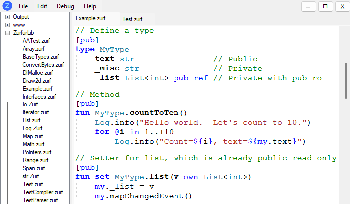

#  Zurfur

Zurfur is is a programming language I'm designing for fun and enlightenment.
The language is named after our cat, Zurfur, who was named by my son.  It's
spelled **_ZurFUR_** because our cat has fur.

## Overview

I love C#.  It's my favorite language to program in.  But, I'd like to fix
some [warts](http://www.informit.com/articles/article.aspx?p=2425867) and have
some features from other languages built in from the ground up.  I'm thinking
about traits, mutability, nullability, ownership, and functional programming.

**Status Update**

Header file generation is working, and I am starting code generation.
Hit F4 to see the header file in JSON format.  The syntax is still being
developed, nothing is set in stone.  Feel free to send me comments letting
me know what you think should be changed.

#### Design Goals

Zurfur takes its main inspiration from C#, but borrows syntax and design
concepts from Golang, Rust, Zig, Lobster, and many other languages.
Here are some key features:

* **Prime directives:**
    * Fun and easy to use
    * Faster than C# and unsafe code just as fast as C
    * Target WebAssembly with ahead of time static compilation
    * Typesafe replacement for JavaScript
    * Stretch goal: Rewrite compiler and IDE in Zurfur on Node.js
* **Mutability, ownership, and nullabilty are part of the type system:**
    * Function parameters must be explicitly marked `mut` if they mutate anything
    * All objects are value types unless explicitly boxed (e.g. `^MyType`)
    * References are non-nullable, but may use `?MyType` or `?^MyType` for nullable
    * `ro` means read only *all the way down* (i.e. you can't mutate a `ro` object through a pointer)
    * Get/set of mutable properties works (e.g. `myList[0].VectorProperty.X = 3` mutates `X`)
    * Deterministic destructors (e.g. `FileStream` closes itself automatically)
* **Fast and efficient:**
    * Return references and span used everywhere. `[]int` is `Span<int>`, and OK to pass to async functions
    * Functions pass parameters by reference, but will pass a copy when it is more efficient
    * Explicit `clone` required when copying an object would require dynamic allocation
    * Most objects are deleted without needing GC.  Heap objects are reference counted.
    * Safe multi-threading via web workers (`DeepClone` and `bag` defined as fast deep copy for message passing)
    * Async acts like a Golang blocking call without the `await` keyword (no garbage created for the task)

#### Inspirations

* [Lobster](http://strlen.com/lobster/) - A really cool language that uses reference counting GC
* [Zig](https://ziglang.org/) - A better and safer C
* [Pinecone](https://github.com/wmww/Pinecone/blob/master/readme.md) - Inspiration to keep plugging away

## Variables

Variables are declared and initialized with the `@` operator
(i.e. the `var` keyword from C#):

    @a = 3                          // a is an int
    @b = "Hello World"              // b is a str
    @c = MyFunction()               // c is whatever type is returned by MyFunction
    @d = [1,2,3]                    // d is List<int>, initialized with [1,2,3]
    @e = ["A":1.0, "B":2.0]         // e is Map<str,f64>
    @f = [[1.0,2.0],[3.0,4.0]]      // f is List<List<f64>>

The above form `@variable = expression` creates a variable with the same type as
the expression.  A second form `@variable type [=expression]` creates an explicitly
typed variable with optional assignment from an expression. 

    @a int = MyIntFunc()                // Error if MyIntFunc returns a float
    @b str                              // b is a string, initialized to ""
    @c List<int>                        // c is an empty List<int>
    @d List<f64> = [1, 2, 3]            // Create List<f64>, elements are converted
    @e Map<str,f32> = ["A":1, "B:1.2]   // Create Map<str,f32>
    @f Json = ["A":1,"B":[1,2,3.5]]     // Create a Json

This form is required for field definitions.

A list of expressions `[e1, e2, e3...]` is used to initialize a `List`
and a list of pairs `[K1:V1, K2:V2, K3:V3...]` is used to initialize a `Map`.
Brackets `[]` are used for both lists and maps. Curly braces are reserved
for statement level constructs.  Constructors can be called with `()`.
For `type MyPointXY(X int, Y int)`, the following are identical:

    @c Map<str, MyPointXY> = ["A": (1,2), "B": (3,4)]           // MyPointXY Constructor
    @d Map<str, MyPointXY> = ["A": (X:1,Y:2), "B": (X:3,Y:4)]   // MyPointXY field initializer
    @a = ["A": MyPointXY(1,2), "B": MyPointXY(3,4)]

## Immutability and References

`ro` means read-only, not just at the top level, but at all levels.  When
a field is `ro`, there is no way to modify or mutate any part of it:

    @a List<MyType>         // `a[0].MyTypeVar = 1` is legal
    @b ro List<MyType>>     // `b[0].MyTypeVar = 1` is not legal

All mutable types are owned, and there is no *implicit* way to accidentally
create a circular reference.  An object may be boxed to *explicitly* create
circular references.  For example, `box MyType()` creates an explicit
reference of type `^MyType`.  Unlike in C#, there are no mutable reference types. 
In Zurfur, a C# type like `List<MyMutableClass>` would translate to `List<^MyMutableClass>`
and `MyMutableClass` is always a value type.

There are immutable reference types, such as `Array` and `str`.  Since they
are immutable and always on the heap (i.e. `type ro heap`), they can be copied
quickly and there is no chance of them aliasing each other.

Other references are short lived and allowed only on the stack.  Most of them
require using the `ref` keyword.  The one exception is that most types are
passed by immutable reference without the `ref` keyword.

## Functions and Properties

Functions are declared with the `fun` keyword. The type name comes after the
argument, and the return type comes after the parameters:

    /// This is a public documentation comment.  Do not use XML.
    /// Use `name` to refer to variables in the code. 
    fun pub Main(args Array<str>):
        Log.Info("Hello World, 2+2={2+2}")

Functions declared at the module level are implicitly `static` without needing
to use the keyword.  Extension methods must be declared at the module level:

    // Declare an extension method for strings
    pub str::Rest() str:
        return this.Count == 0 ? "" : str(this[1..])

Properties are declared with `get` and `set` keywords:

    get pub MyString() str:
        return myString

    set pub MyString(v str):
        myString = v
        MyStringChangedEvent()
  
By default, function parameters are passed as read-only reference.  The
exception is that small types (e.g. `int`, and `Span<T>`) are passed by
copy because it is more efficient to do so.  Other qualifiers, `mut`, `ref`,
and `own` can be used to change the passing behavior:

    fun pub Test(
        a               int,  // Pass a copy because it is efficient (i.e. `type passcopy`)
        b       mut ref int,  // Pass by ref, allow assignment
        c         List<int>,  // Pass by ref, read-only
        d     mut List<int>,  // Pass by ref, allow mutation, but not assignment
        e ref mut List<int>,  // Pass by ref, allow mutation and assignment
        f     own List<int>)  // Take ownership of the list

List of the qualifiers, and what they mean:

| Qualifier | Passing style | Notes
| :--- | :--- | :---
|  | Read-only reference | Can copy for small `passcopy` types (e.g. `int`, `Span`, etc.)
| mut | Allow mutation but not assignment | Not valid for `ro` types (e.g. `Array`, `Span`, etc.)
| ref mut | Allow mutation and assignment | Requires annotation (i.e. `ref`) at the call site
| own | Take ownership | Not valid for `ro` types and types that don't require allocation (.e.g. `int`, `str`, `Array`, plain old data, etc.)

Arguments passed by `mut` do not need to be annotated at the call site.  This
is because it is obvious that `f(myList)` could mutate `myList` and it's easy
enough to see if `f` does that just by hovering over the definition. 

Arguments passed by `mut ref` must be annotated at the call site
(e.g. `f(ref myInt)`).  This is because it is not quickly obvious that the
entire object could be replaced.  Furthermore, it would not be obvious that
`f(myInt)` or `f(myString)` would change the value.  

If the type is mutable *and* requires dynamic allocation, the function can
take ownership of the object by using the `own` keyword.  The caller must
then never use the object again, or must explicitly `clone` the object.

Functions can return multiple values:

    // Multiple returns
    fun pub Circle(a f64, r f64) -> (x f64, y f64):
        return Cos(a)*r, Sin(a)*r

The return parameters are named, and can be used by the calling function:

    @location = Circle(a, r)
    Log.Info("X: {location.x}, Y: {location.y}")

Normally the return value becomes owned by the caller, but this behavior
can be changed with the `ref` keyword:

    fun pub GetRoList() ref List<int>:          // Read only ref
        return ref myListField
    fun pub GetMutList() mut List<int>:         // Mutable (mutation allowed, assignment not allowed)
        return mut myListField
    fun pub GetMutRefList() mut ref List<int>:  // Mutable ref (mutation or assignment is allowed)
        return mut ref myListField

Return qualifiers:

| Qualifier | Passing style | Notes
| :--- | :--- | :---
|  | Caller takes ownership | A move or copy operation is performed
| mut | Caller may mutate, but not assign | Not valid for `ro` types (e.g. `str`, `Array`, `Span`, etc.)
| ref mut | Caller may mutate or assign | Requires annotation (i.e. `ref`) at the call site

## Types

The ones we all know and love:

    i8, u8, byte, i16, u16, i32, u32, i64, int, u64, f32, f64, xint
    
`byte` is an alias for `u8`.  `int` is an alias for `i64`.  `xint` is either
i32 or i64 depending on the compilation target.

| Type | Description
| :--- | :---
| Array\<T\> | An immutable array of **immutable** elements and a constant `Count`.  Even if the array contains mutable elements, they become immutable when copied into the array.
| str | An `Array<byte>` with support for UTF-8.  `Array` is immutable, therefore `str` is also immutable
| Buffer\<T\> | A mutable array of mutable elements, but with a *constant* `Count`
| List\<T\> | Dynamically sized mutable list with mutable elements
| Span\<T\> | Span into `Array`, `Buffer`, or `List`.  It has a constant `Count`.  Mutability of elements depends on usage (e.g Span from `Array` is immutable, Span from `Buffer` or `List` is mutable)
| Map<K,V> | Unordered mutable map.  There is also `RoMap` which is immutable.
| Json | Json data structure

There are several different kinds of types.  There is `ro` for a read-only
immutable type.  And there is `heap` for a type always allocated on the heap.
Even though a mutable heap type is a reference, it still has an owner and acts
like a value type.  There is `heap ro` which is an immutable reference type
with fast implicit copy because it just copies the reference.

| Type Qualifier | Examples | Passing Style | Explicit Clone Required | Clone Speed
| :--- | :--- | :--- | :--- | :---
|passcopy | int, f64, Span | Copy | No | Fast, small, never allocates
|  | List, Map | Ref | If it allocates | Medium (copy bytes) or Slow (if it allocates)
| ro | | Ref | No | Medium, copy bytes, never allocates
| heap | Buffer | Ref | Yes | Slow, always allocates
| heap ro | str, Array, RoMap | Ref | No | Fast
| nocopy | FileStream | Owned | No Clone | Move only (medium speed)

Notice that `List` and `Map` are not `heap`.  They live directly inline in the
object that owns them, but they do contain a reference to a `Buffer` which is 
directly on the heap. Because they are mutable and use dynamic allocation,
`List`, `Map`, and `Buffer` require an explicit clone.

Also notice that `Array` and `str` are `heap ro`.  They are reference types
and don't require an explicit clone.

### Simple Types

Simple types can declare fields in parentheses.  All fields are public
and no additional fields may be defined in the body.  Simple types are
mutable by default, but can also be immutable by adding the `ro` qualifier.

    // Simple types - all fields are public
    type pub Point(X int, Y int)
    type pub Line(P1 Point, P2 Point)
    type pub WithInitialization(X int = 1, Y int = 2)
    type pub ro ReadOnlyPerson(Id int, FirstName str, LastName str, BirthYear int)

    // A simple type may define properties, functions, and
    // constructors in the body but no additional fields
    type pub Point(X int, Y int)
    {
        fun new(p int):
            todo()
        fun pub mut SetY (y int):       // Mutable functions are marked `mut`
            Y = y
        get pub PropX() int:
            return X
        set pub PropX(value int):
            X = value
    }

The default constructor can take all the fields in positional order, or any
of the fields as named parameters.  There is also a default `clone` function.

    @w = Point()                        // Default constructor
    @x = Point(1,2)                     // Constructor with all parameters
    @y = Point(X: 3, Y: 4)              // Initialized via named parameters
    @z = WithInitialization(X: 5)       // Constructor called first, so Y=2 here
    @p1 = Person(1, "John", "Doe", 32)

A mutable type returned from a getter can be mutated in-place provided there
is a corresponding setter:

    @a List<Point> = [(1,2), (3,4), (5,6)]
    a[1].PropX = 23     // a = [(1,2),(23,4), (5,6)]
    a[1].SetY(24)       // a = [(1,2),(23,24), (5,6)]
    a[1].PropX = 0      // a = [(1,2),(0,24), (5,6)]

`List` returns the point via reference, but even if it used a getter/setter,
this would still work.  `SetY` is marked with `mut` so the compiler
knows to call the setter after the value is modified.  Same for `PropX`.

### Complex Types

A complex type must define all of its fields in the body. Fields are declared
with `@` and are private.  Public properties can be added with `pub get`,
`pub get set`, `pub ref` or `pub mut ref`.

    type pub Example
    {
        // Mutable fields
        @text1 str = "hello"                // Private, no public
        @Text2 str pub get = "hello"        // Public read only
        @Text3 str pub get set = "hello"    // Public read/write
        @List1 List<int> pub get = [1,2,3]  // Returns a copy (not a ref)
        @List2 List<int> pub ref;           // Returns read-only ref 

        // Read-only fields
        @roText1 ro str                     // Constructor can override
        @roText2 ro str = "Hello"           // Constructor cannot override
        @RoText3 ro str pub init = "Hello"  // Constructor or client can override
        
        // Getter returning a copy
        get pub Text() str:
            return text1

        // Setter
        set pub Text(value str)
            if value == text:
                return
            text1 = value
            SendTextChangedEvent()

        // Getter returning a reference (same as the `text2` field definition above)
        get pub MyText2() ref str:
            return ref text2

        // Getter allowing client code to set (same as `text3` field definition above)
        get pub MyMutText3() mut ref str:
            return ref text3
    }

The entire type may be `ro`, or individual fields can use `ro` to indicate read only. 

There is a default constructor taking all public fields and settable properties
as named parameters.  There is also a `clone` function. The default constructor
and `clone` function can override `ro` fields, but not properties unless they
have a public setter. **TBD:** Is that rule too easy to forget?

    @e1 = Example()
    @e2 = Example(Text: "Hello", MyMap: ["x":1, "y":2])
    @e3 = e1.clone(MyStrings: ["1", "2", "3"])

    @e4 = Example(HelloInit: "Hi")          // Overriding field is OK
    @e5 = Example(HelloNoInit: "Hi")        // Illegal, no public setter
    @e6 = e1.clone(HelloNoInit: "Hi")       // Illegal, same rule as constructor

### Anonymous Type

An anonymous type can be created like this: `@a = type(x f64, y f64)`
or `@a = type(x=1, y=MyFunc())`.  Fields are public, and do not need
explict type names when used as a local variable. 

    @a = type(x=1, y=2)
    Log.Info("X={a.x}, Y={a.y}")   // Prints "X=1, Y=2"

### New, Equality, Clone, and Drop

The `new` function is the type constructor.  It does not have access to
`this` and may not call member functions except for another `new` function
(e.g. `new(a int)` may call `new()`).  `unsafe` can be used to get access
to `this` in the constructor.  `init` is called after the object is
created and it has access to `this` and may call other member functions.

`Equals`, `GetHashCode`, `Clone`, and `DeepClone` are generated automatically
for types that don't contain pointers or define a `drop` function.  The `Equals`
function compares values, not object references (although object references may
be used to speed up the comparison).  Types that don't have an `Equals` function
may not be compared with `==` or `!=`.

Like Rust, an explicit `clone` is required to copy any type that requires
dynamic allocation.  If the type contains only `int`, `str`, and `Array`,
it will implicitly clone itself.  If the type contains `List`, `Map`, or
`Buffer`, it must be explicitly cloned.  Some types, such as `FileStream`
can't be cloned at all.

`clone` clones the entire object, but does a shallow copy of pointers.
For instance, `List<MyType>>` is cloned fully provided that `MyType`
doesn't contain a pointer.  Even if `MyType` contained a `List<str>`,
everything is cloned.  For `List<^MyType>`, the pointer is copied
and `MyType` is not cloned.  `DeepClone` can be used to clone the
entire object graph regardless of pointers or circular references.

A type may define `drop`, which is called deterministically when the
object goes out of scope. If the object is boxed (e.g. `^MyType`), then
there is no such guarantee.  Boxed objects may have `drop` called at any
time after they are no longer reachable.  If a `^FileStream` were still
open when the object is dropped non-deterministically, it is considered
a programming error. In debug mode, the debugger would stop.  In release
mode, an error is logged, but the program would carry on.

The `drop` function does not have access to any references or `boxed`
types.  There is no zombie resurrection. 

### Lambda and Function Variables

The `@` symbol is used to make it easy to recognize new local variables:

    // Find max value and sort the list using lambdas
    @a = 0
    myList.For(@item => { a.max = Math.Max(item, a.max) })
    myList.Sort(@(a,b) => a > b)
    Log.Info("Sorted list is {myList}, maximum value is: {a.max}")

Inside the lambda function, `return` is forbidden since it doesn't return
from thom the nearest `fun` scope.  Instead, `exit` is used.

**TBD:** Consider how to `break` out of the lambda.  Use a return type of `Breakable`?

#### Array, List, and Buffer

`List` is the default data structure for working with mutable data.  Once the
list has been created, it can be converted to an `Array` which is immutable.
Assigning to an array is very fast since it is just copying a reference,
whereas assigning to a `List` will create a copy unless it can be optimized
to a move operation.

    @x = [1,2,3]            // x is List<int>
    @y = ["A", "B", "C"]    // y is List<str>
    @z = [[1,2,3],[4,5,6]]  // z is List<List<int>>
    x.Push(4)               // x contains [1,2,3,4]
    x.Push([5,6])           // x contains [1,2,3,4,5,6]
    @a = x.ToArray()        // a is Array<int>
    fieldx = x              // fieldx is a copy of x (with optimization, x may have been moved)
    fielda = a              // fielda is always a reference to the array `a`

`List` should be used to build and manipulate mutable data, while `Array`
should be used to store immutable data.  A `Buffer` is a list with a fixed
size.  It is more efficient than a `List`, but less flexible.

#### Strings

Strings (i.e. `str`) are immutable byte arrays (i.e. `Array<byte>`), generally
assumed to hold UTF8 encoded characters.  However, there is no rule enforcing
the UTF8 encoding so they may hold any binary data.

String literals start with a quote `"` or they can be translated at runtime
using `tr"string"` syntax.  All strings are interpolated (i.e. they do not
need to start with `$`) and the syntax is largely the same as C#.  The
backslash `\` is interpreted literally and does not create a control character.
Control characters may be placed directly inside an interpolation (e.g.
`{\t}` is a tab).

There is no `StringBuilder` type, use `List<byte>` instead:

    @sb = List<byte>()
    sb.Push("Count to 10: ")
    for @count in 1::10
        sb.Push(" {count}")
    return sb.ToArray()

#### Span

Span is a view into a string, array, buffer, or list.  They are `ref type` and
may never be stored on the heap.  Unlike in C#, a span can be used to pass
data to an async function.  

Array syntax translates directly to Span (not to Array like C#).
The following definitions are identical:

    // The following definitions are identical:
    afun mut Write(data Span<byte>) int error impl
    afun mut Write(data []byte) int error impl

Spans are as fast, simple, and efficient as it gets.  They are just a pointer
and count.  They are passed down the *execution stack* or stored on the async
task frame when necessary.  More on this in the GC section below.

Given a range, the index operator can be used to slice a List.  A change to
the list is a change to the span and a change to the span is a change to the list.

    @a = ["a","b","c","d","e"]  // a is List<str>
    @b = a[1..4]                // b is a span, with b[0] == "b" (b aliases ["b","c","d"])
    @c = a[2::2]                // c is a span, with c[0] == "c" (c aliases ["c","d"])
    c[0] = "hello"              // now a = ["a","b","hello","d","e"], and b=["b","hello","d"]

When the `Count` or `Capacity` of a list changes, all spans pointing into it
become detached.  A new buffer is cloned and used by the list, but the old
spans continue aliasing the old data. 

    @list = List<byte>()
    list.Push("Hello Pat")  // list is "Hello Pat"
    @slice = a[6::3]        // slice is "Pat"
    slice[0] = "M"[0]       // slice is "Mat", list is "Hello Mat"
    list.Push("!")          // DEBUG PANIC - slice is now detached, list is "Hello Mat!"
    slice[0] = "C"[0]       // slice is "Cat", list is still "Hello Mat!"

Mutating the size of a list (not the elements of it) while there is a span
pointing into it is a programming error and will throw an exception, the
same as indexing outside of array bounds.

#### Map and RoMap

`Map` is a hash table and is similar to `Dictionary` in C#.

    @a = ["Hello":1, "World":2]     // a is Map<str,int>
    @b = a["World"]                 // b is 2
    @c = a["not found"]             // throws exception
    @d = a.Get("not found")         // d is 0
    @e = a.Get("not found", -1)     // e is -1

`RoMap` is an immutable version of `Map`

#### Json

`Json` is the built in Json object with support communication with JavaScript.  
Using an invalid key does not throw an exception, but instead returns a default
empty object.

    @a Json = ["Hello":1, "World":2]
    @b = a["World"]                         // b is Json(2), not an int
    @c = a["World"].Int                     // c is 2
    @d = a["World"].Str                     // d is "2"
    @e = a["not found"]["?"].int            // e is 0

The `Json` data structure is meant to be quick and easy to use, not necessarily
the fastest or most efficient. For efficient memory usage, `Json` will support
[Newtonsoft](https://www.newtonsoft.com/json) style serialization:

Another example:

    @a Json = [
        "Param1" : 23,
        "Param2" : [1,2,3],
        "Param3" : ["Hello":12, "World" : "Earth"],
        "Time" : "2019-12-07T14:13:46"
    ]
    @b = a["Param1"].Int            // b is 23
    @c = a["param2"][1].Int         // c is 2
    @d = a["Param3"]["World"].Str   // d is "Earth"
    @e = a["Time"].DateTime         // e is converted to DateTime
    a["Param2"][1].Int = 5          // Set the value

    
### Enum

Enumerations are similar to C# enumerations, in that they are just
a wrapped `int`.  But they are implemented internally as a `type`
and do not use `,` to separate values.

    pub enum MyEnum
    {
        A           // A is 0
        B; C        // B is 1, C is 2
        D = 32      // D is 32
        E           // E is 33
    
        // Enumerations can define ToStr
        fun ToStr() str
            return MyConvertToTranslatedName()
    }

The default `ToStr` function shows the value as an integer rather
than the name of the field, but it is possible to override and make it
display anything you want.  This allows enumerations to be just as light
weight as an integer and need no metadata in the compiled executable.

**TBD:** Differentiate an enum having only scalar values vs one with flags?
The one with flags allows `|` and `&`, etc but the other doesn't.

## Operator Precedence

Operator precedence is mostly from Golang, but more compatible
with C and gives an error where not compatible:

|Operators | Notes
| :--- | :---
|x.y  f<type>(x)  a[i] | Primary
|- ! & ~ * sizeof use unsafe cast| Unary
|@|Capture new variable
|as is | Type conversion and comparison
|<< >>| Bitwise shift (not associative, can't mix with arithmetic operators)
|* / % & | Multiply, bitwise *AND* (can't mix arithmetic and bit operators)
|~| Bitwise *XOR* (can't mix with arithmetic operators)
|+ - &#124; | Add, bitwise *OR* (can't mix arithmetic and bit operators)
|Low..High, Low::Count|Range (inclusive of low, exclusive of high)
|== != < <= > >= === !== in|Not associative, === and !== is only for pointers
|&&|Conditional
|&#124;&#124;|Conditional
|a ? b : c| Not associative, no nesting (see below for restrictions)
|=>|Lambda
|key:Value|Key value pair (only inside `()`, `[]` or where expected)
|,|Comma Separator (not an expression)
|= += -= *= /= %= &= |= ~= <<= >>=|Assignment Statements (not an expression)
|=>|Statement Separator

The `~` operator is both xor and unary complement, same as `^` in Golang.

The `@` operator captures the expression into a new variable.
For instance `while stream.Read(buffer)@length != 0 {...}`
captures the value returned by `Read` into the new variable `length`.
Or, `if maybeNullObjectFunc()@nonNullObject { }` can be used to
convert `?Object` into `Object` inside of the braces. 

The bitwise shift operators `<<` and `>>` are higher precedence than other
operators, making them compatible with C for bitwise operations.  Bitwise
and arithmetic operators may not be mixed, for example both `a + b | c` and
`a + b << c` are illegal.  Parentheses may be used (e.g. `(a+b)|c` is legal)

The range operator`..` takes two `int`s and make a `Range` which is a
`type Range(High int, Low int)`.  The `::` operator also makes a
range, but the second parameter is a count (`High = Low + Count`).  

Operator `==` does not default to object comparison, and only works when it
is defined for the given type.  Use `===` and `!==` for object comparison. 
Comparisons are not associative, so `a == b == c` is illegal.

The ternary operator is not associative and cannot be nested.  Examples
of illegal expresions are `c1 ? x : c2 ? y : z` (not associative),
`c1 ? x : (c2 ? y : z)` (no nesting).  The result expressions may not
directly contain an operator with lower precedence than range.
For example, `a==b ? x==3 : y==4` is illegal.  parentheses can be
used to override that behavior, `a==b ? (x==3) : (y==4)` and
`a==b ? (@p=> p==3) : (@p=> p==4)` are acceptable.

The pair operator `:` makes a key/value pair which can be used
in an array to initialize a map.

Assignment is a statement, not an expression.  Therefore, expressions like
`a = b = 1` and `while (a = count) < 20` are not allowed. In the latter
case, use `while count@a < 20`.  Comma is also not an expression and may
only be used where they are expected, such as a function call or lambda.

#### Operator Overloading

`+`, `-`, `*`, `/`, `%`, and `in` are the only operators that may be individually
defined.  The `==` and `!=` operator may be defined together by implementing
`static fun Equals(a myType, b myType) bool`.  All six comparison operators,
`==`, `!=`, `<`, `<=`, `==`, `!=`, `>=`, and `>` can be implemented with just
one function: `static fun Compare(a myType, b myType) int`.  If both functions
are defined, `Equals` is used for equality comparisons, and `Compare` is used
for the others.

Overloads using the `operator` keyword are automatically `static`.  Only
static versions of `Equals` and `Compare` are used for the comparison operators.
Zurfur inherits this from C#, and Eric Lippert
[gives a great explanation of why](https://blogs.msdn.microsoft.com/ericlippert/2007/05/14/why-are-overloaded-operators-always-static-in-c).

## Statements

Like Golang, semicolons are required between statements but they are
inserted automatically at the end of lines based on the last non-comment
token and the first token of the next line. Like C#, curly braces can be
placed anywhere.  Both end-of-line and beginning-of-next-line are acceptable.
The Zurfur IDE shrinks curly brace only lines so they take the same vertical
space as the brace-at-end style as when using a regular editor.

Unlike Golang and C#, compound statements (`if`, `else`, `while`, `for`, etc.)
can accept multiple lines without needing braces, but the indentation is
checked to make sure it matches the expected behavior.

By convention, most code in the Zurfur code base uses curly brace on
beginning-of-next-line style and omits braces when they aren't needed.

Here are the enforced style rules:

1. No tabs anywhere in the source code
2. No white space or visible semi-colons at the end of a line
3. Indentation is enforced.  Minimum indentation is two spaces,
   but the Zurfur code base uses four.
4. One statement per line, unless it's a continuation line.
   It's a continuation line if:
   1. The end of the previous line is `{`, `[`, `(`, or `,`.
   2. The line begins with `"`, `{`, `]`, `)`, `,` or an operator.
      Operators include `+`, `.`, `=`, etc.
   3. A few exceptions where continuations are expected (e.g. `where`,
      `require`, and a few other places)
5. Continuation lines must not be separated by a blank line or comment-only line.
6. Compound statements (e.g. `if`, `while`, `for`, etc.) may use curly braces
   or may omit them.  When braces are omitted, the compound part of the statement:
   1. Must be the inner most level (i.e, the compound
      statement may not include another compound statement)
   2. Must on the next line and be indented
   3. Must not be empty
   4. May use multiple lines and multiple statements
   4. Must have all lines at the same indentation level
7. A brace, `{`, cannot start a scope unless it is in an expected place such as after
`if`, `while`, `scope`, etc., or a lambda expression.
8. Modifiers must appear in the following order: `pub` (or `protected`, `private`),
`unsafe`, `static` (or `const`), `unsealed`, `abstract` (or `virtual`, `override`,
`new`), `ref`, `mut` (or `ro`)

#### While and Do Statements

The `while` loop is the same as C#.  The `do` loop is similar to C#
except that `dowhile` is used at the end of the loop, and the condition
executes inside the scope of the loop:

    do:
        @accepted = SomeBooleanFunc()
        DoSomethingElse()
    dowhile accepted

#### Scope Statement

The `scope` statement creates a new scope:

    scope:
        @file = use File.Open("My File")
        DoStuff(file)
    // File variable is out of scope here

The `scope` statement can be turned into a loop using the `continue` statement:

    scope:
        DoSomething()
        if WeWantToRepeat()
            continue

Likewise, `break` can be used to exit early.

#### For Loop

For the time being, `for` loops only allow one format: `for @newVariable in expression`. 
The new variable is read-only and its scope is limited to within the `for` loop block.
The simplest form of the for loop is when the expression evaluates to an integer:

    // Print the numbers 0 to 9
    for @i in 10:
        Console.WriteLine(i)   // `i` is an integer

    // Increment all the numbers in an list
    for @i in list.Count:
        list[i] += 1

The range operators can be used as follows:

    // Print all the numbers in the list
    for @i in 0..list.Count:
        Console.WriteLine(list[i])

    // Collect elements 5,6, and 7 into myList
    for @i in 5::3:
        myList.Add(myArray[i])

Any object that supplies an enumerator (or has a `get` indexer and a `Count` property)
can be enumerated.  The `Map` enumerator supplies key value pairs:

    // Print key value pairs of all elements in a map
    for @kv in map:
        Console.WriteLine("Key: " + kv.Key.ToString() + " is " + kv.Value.ToString())

The expression after `in` is evaluated at the start of the loop and never
changes once calculated:

    // Print the numbers from 1 to 9
    @x = 10
    for @i in 1..x:
        x = x + 5               // This does not affect the loop bounds 
        Console.WriteLine(i)

When iterating over a collection, just like in C#, it is illegal to add
or remove elements from the collection.  An exception is thrown if
it is attempted.  Here are two examples of things to avoid:

    for @i in myIntList:
        myIntList.Add(1)   // Exception thrown on next iteration

    // This does not remove 0's and increment the remaining elements
    // The count is evaluated only at the beginning of the loop.
    for @i in myIntList.Count:
        if myIntList[i] == 0:
            RemoveAt(i)        // There are at least two problems with this
        else:
            myIntList[i] += 1 // This will throw an exception if any element was removed
 
#### Switch and Match

Both `switch` and `match` are reserved for future use.  For now, use `if`,
`elif`, and `else` to simulate them:

    if myNum < 1:
        DoStuff()
        DoOtherStuff()
    elif myNum in 1..3:
        DoMoreStuff()
    else myNum >= 3:
        DoTheLastThing()

## Errors and Exceptions

We will try for something similar to this: [Midori](http://joeduffyblog.com/2016/02/07/the-error-model/).

|Error Type | Action | Examples
| :--- | :--- | :---
|Normal | Checked by caller | File not found, network io, permissions, etc.
|Exceptional | Stack unwind & cleanup | Array bounds, `require` failed, etc.
|Critical | End process | Memory corruptiopn

Most errors should follow the normal path.  A function marked with `error` may
either return a result or an error, for example:

    pub afun mut Read(data mut Span<byte>) int error impl

Exceptional cases are programming errors, and should not be used
intentionally.  They unwind the stack, cleanup after themselves, 
and stay memory safe.  They can be recovered, but care should be
taken when recovering and they always generate a stack trace.

## Traits

Zurfur will use Rust style traits.

Most traits are dispatched statically.  When dynamic dispatch is required,
it is implemented using a fat pointer containing a reference to a VTable
and a reference to the object. 

See [Interface Dispatch](https://lukasatkinson.de/2018/interface-dispatch/)
and scroll down to *Fat Pointers*.  A comment by Russ Cox explains why
this is a good design choice "*The key insight for Go was that in a statically
typed language, type conversions happen far less often than method calls, so doing
the work on the type conversion is actually quite cheap.*"

## Garbage Collection

**TBD:** Explain the difference between forward references and
return references, and how they will be "covered" when passed
down the execution stack.

Thanks to [Lobster](https://aardappel.github.io/lobster/memory_management.html)
and the single threaded nature of JavaScript, I have decided that it is
OK to use reference counting.  Since everything is single threaded, no locks
are needed and it's very fast.  A real-time embedded system could be written
in Zurfur, and all that needs to be done is verify that no object graph
cycles are created during program execution.

Even if we need a tracing collector because cycles are created, it can skip
all data structures that can't cycle.  For instance, a 100Mb `Map<str,str>`
doesn't need to be traced since it can't have a cycle.

Calling an async function doesn't create garbage because each task has its
own stack.  No dynamic allocations are needed for async calls.

## Threading

The first version of Zurfur is targeted at replacing JavaScript, and will
support multi-threading only via web workers and message passing.  Each web
worker has its own address space, so everything appears to be single threaded.

JavaScript has done pretty well with the single threaded model.
IO is async and doesn't block.  Long CPU bound tasks can be
offloaded to a web worker.  Even Windows uses a single threaded
model for user interface objects.

## Raw Pointers

The unary `*` operator dereferences a pointer.  The `.` operator is used to access fields
or members of a pointer to the type (so `->` is not used for pointers). 
 
    fun pub static strcpy(dest *byte, source *byte):
        while *source != 0
            { *dest = *source;  dest += 1;  source += 1 }
        *dest = 0

#### Pointer Safety

For now...

Pointers are not safe.  They act axactly as they do in C.  You can corrupt
memory and crash your application.  They can be null, and the compiler
does not add run time null checks.  The data they point to is always
mutable.  There are three reasons for this.

First, it makes porting from C easier.  I need to port DlMalloc without
worrying about pointer type safety.  Second, they are fast.  It is
necessary to have low level libraries and infrustructure running
fast and efficiently.  Third, without pointers, Zurfur is a type
safe language.  Pointers should only be used where necessary.

Perhaps, after Zurfur is running, I might add a few things from
[Zig](https://ziglang.org/).  Among them is null safety (e.g. `?*int`),
explicit array types (i.e. `*[]int`), and mutability attribute.
That would be a major breaking change, which might be acceptable if
done before version 1.0.  But, speed cannot be sacrificed.

Pointers are never tracked by the GC.  Any object that may have a
pointer pointing into it must be pinned.

In an unsafe context, pointers can be cast from one type to another
using the `cast` operator.  The format is `cast(type)expression`.
For those coming directly from C, it will look almost the same
as an old C style cast, except the keyword `cast` must be used.

    @b = cast(*int)myFloatPtr   // Cast myFloatPtr to *int

## Packages and Modules

A package is like a C# assembly.  It is the basic unit for distributing
a library or application and is a .`zip` file with a `.zil` extension.
It will be defined here [ZIL Specification](Doc/Zil.md).

Modules are like a C# static class and namespace combined.  They can contain
static functions, fields, and extension methods.  From within a package,
module names act like namespaces and stitch together just as they do in C#.
From outside the package, they look and act like a C# static class.

The `module` keyword does not nest, or require curly braces.  The module name
must be declared at the top of each file, after `use` statements, and before
type, function, or field definitions.  A file may contain other modules, but
all of them must be nested inside the top level module:

    module MyCompany.MyProject               // Top level module
    module MyCompany.MyProject.Utils         // Ok since it is nested in the top level
    module MyCompany.MyProject.OtherUtils    // Ok since it is also nested
    module MyCompany.MyOtherProject          // ILLEGAL since it is not nested

Package names should be unique across the world, such as a domain name
followed by a project (e.g. `com.gosub.zurfur`).  For now, top level module
names must be unique across an entire project.  If there are any top level
module name clashes, the project will fail to build.  In the future, there
may be syntax or project settings to resolve that.

## Async

Golang's concept of async is awesome.  Everything should be async by
default, but look as if it were sync. 

The problem with this approach is that WebAssembly doesn't support
the same kind of stack switching used by Golang. It would be difficult
to optimize function calls through a delegate that may or may not be
async.  One of the goals of Zurfur is that it be as fast and efficient
as C, so this is too high a price to pay.

For the time being, async is built into the type system but it looks and
acts as if it were sync.  Calling an async function from async code blocks
without using the `await` keyword:

    afun MySlowIoFunctionAsync(server str) str:
        // In C# `await` would be needed before both function calls
        @a = MakeXhrCallToServerAsync(server)    // Blocks without await keyword
        Task.Delay(100);                            // Also blocks without a keyword
        return a;

Notice that async functions are defined with the `afun` keyword.

Async code normally looks and acts as if it were sync.  But, when we want
to start or wait for multiple tasks, we can also use the `astart` and
`await` keywords.

    afun GetStuffFromSeveralServers() str:
        // Start the functions, but do not block
        @a = astart { MySlowIoFunctionAsync("server1") }
        @b = astart { MySlowIoFunctionAsync("server2") }
        @c = astart { MySlowIoFunctionAsync("server3") }

        // The timeout cancels the task after 10 seconds, but we'll hand
        // the task to the user who may push a button to cancel early
        // TBD: Timeouts and cancellation are still TBD
        @timeout = astart Task.Delay(10000); 
        GiveThisTaskToAUserWhoCancelTheOperationEarly(timeout)

        // Collect the results in the order they complete order
        @sum = new list<str>()
        await a, b, c, timeout:
            case a.HasResult: sum += a.Result
            case b.HasResult: sum += b.Result
            case c.HasResult: sum += c.Result
            case a.HasException: sum += "a failed"   // It threw an exception but swallow it and continue
            case b.HasException: sum += "b failed"   // Cancel remaining tasks and exit immediately
            case timeout.HasResult: break            // 10 seconds has passed, cancel automatically
            case timeout.HasException: break         // The user has canceled the operation early
            // TBD: break cancels all remaining tasks
            // TBD: If `c` throws, all remaining tasks are canceled.

        // TBD: The only way to get out of an `await` is when all of the awaited
        // tasks have completed completed (possibly with an exception)

        // Not strictly necessary, but TBD good practice? 
        // TBD: Make sure Task functions can use `FinalizeNotify` to clean up
        timeout.Cancel()

A sync function cannot implicitly call an async function, but it can start it
using the `astart` keyword, like this: `fun MySyncFunction() { astart MyAsyncFunction() }`

#### Async Implementation 

Async will be implemented with an actual stack, not with heap objects. 
This should improve GC performance since each task call won't be
required to create a heap allocation.  Stacks themselves won't be
GC objects.  Instead there will be a reusable list of stack arrays.

#### Async by Default?

Should everything be async by default? The compiler can figure out if a
function needs to be async, and can optimize most sync code into sync
functions.  There are two problems here.

First, the compiler would have trouble optimizing lambda function calls.
If `List<T>.Sort(compare fun(a T, b T) bool)` is compiled
as async, it would be an efficiency disaster.

Second, it would be far to easy for a function to *accidentally* be changed
from sync to async.  Imagine the consequences of changing `malloc` or `new`
to async.  A library that was previously sync and fast could all of a sudden
become async and slow without even realizing it was happening.

One solution could be to mark functions `sync`, something like
`List<T>.Sort(compare sfun(a T, b T) bool)`.  This seems almost as bad
as marking them async.  Are there better solutions?

## Open Questions

Should NAN`s compare the way IEEE numbers are supposed to? Since this is a new
language, my preference would be to have them compare so NAN != NAN and they
sort so NAN > INF.  This way we don't have to worry about doing special
things for Map or sorted collections.  OTOH, it could be confusing when
porting code from other places.  OTOOH, I've had plenty of problems with
the IEEE comparison behavior as it is.

