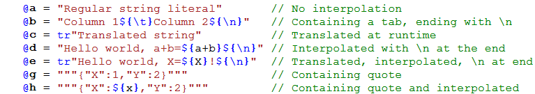

# Zurfur

Zurfur is is a programming language I'm designing for fun and enlightenment.
The language is named after our cat, Zurfur, who was named by my son.  It's
spelled **_ZurFUR_** because our cat has fur.

I love C#.  It's my favorite language to program in.  But, I'd like to have
some features from other languages built in from the ground up.  I'm thinking
about ownership, immutability, nullability, and functional programming.

**Status Update**

I am working on assembly language generation. Hit F4 then click the `Code.zil`
tab to see it.  The syntax is still being developed, nothing is set in stone.
Feel free to send me comments letting me know what you think should be changed.

## Design Goals

Zurfur takes its main inspiration from C#, but borrows syntax and design
concepts from Golang, Rust, Zig, Python, JavaScript, and other languages.
Here are some key features:

* **Prime directives:**
    * Fun and easy to use
    * Faster than C# and unsafe code just as fast as C
    * Target WebAssembly with ahead of time static compilation
    * Typesafe replacement for JavaScript
* **Ownership, mutability, and nullabilty are part of the type system:**
    * All objects are value types except for pointers (e.g. `^MyType`) and short lived references (e.g. `ref myValue`)
    * `ro` means read only *all the way down* (not like C#, where `readonly` only protects the top level)
    * Function parameters must be explicitly marked `mut` if they mutate anything
    * References and pointers are non-nullable, but may use `?MyType` or `?^MyType` for nullable
    * Deterministic destructors (e.g. `FileStream` closes itself automatically)
* **Fast and efficient:**
    * Return references and span used everywhere. `[]Int` is `Span<Int>`
    * Functions pass parameters by reference, but will pass a copy when it is more efficient
    * Explicit `clone` required when copying an object that requires dynamic allocation
    * Most objects are deleted without needing GC.  Heap objects are reference counted.

## Variables

Variables are declared and initialized with the `@` operator
(i.e. the `var` keyword from C#):

    @a = 3                          // a is an Int
    @b = "Hello World"              // b is a Str
    @c = myFunction()               // c is whatever type is returned by myFunction
    @d = [1,2,3]                    // d is List<Int>, initialized with [1,2,3]
    @e = ["A":1.0, "B":2.0]         // e is Map<Str,F64>
    @f = [[1.0,2.0],[3.0,4.0]]      // f is List<List<F64>>

The above form `@variable = expression` creates a variable with the same type as
the expression.  A second form `@variable type [=expression]` creates an explicitly
typed variable with optional assignment from an expression. 

    @a Int = myIntFunc()   // Error if myIntFunc is F32, ok if Int has constructor to convert
    @b Str                              // b is a string, initialized to ""
    @c List<Int>                        // c is an empty List<Int>
    @d List<F64> = [1, 2, 3]            // Create List<F64>, elements are converted
    @e Map<Str,F32> = ["A":1, "B:1.2]   // Create Map<Str,F32>
    @f Json = ["A":1,"B":[1,2,3.5]]     // Create a Json

A list of expressions `[e1, e2, e3...]` is used to initialize a `List`
and a list of pairs `[K1:V1, K2:V2, K3:V3...]` is used to initialize a `Map`.
Brackets `[]` are used for both lists and maps. Curly braces are reserved
for statement level constructs.  Constructors can be called with `()`.
For `type MyPointXy(x Int, y Int)`, the following are identical:

    @c Map<Str, MyPointXy> = ["A": (1,2), "B": (3,4)]           // MyPointXy Constructor
    @d Map<Str, MyPointXy> = ["A": (x:1,y:2), "B": (x:3,y:4)]   // MyPointXy field initializer
    @a = ["A": MyPointXy(1,2), "B": MyPointXy(3,4)]

## Functions, Methods, Getters, and Setters

Functions are declared with the `fun` keyword. The type name comes after the
argument, and the return type comes after the parameters:

    // This comment is public documentation.
    // Use `name` to refer to variables in the code. 
    fun main(args List<Str>)
        Log.info("Hello World, 2+2=${2+2}")

Methods are declared outside of the type and use the `my` keyword to
refer to fields or other methods in the type:

    // Declare a method for strings
    fun Str.rest() Str
        return if(my.len == 0, "" : my.subRange(1))  // `subRange` is defined by `List`

Methods defined on generic types automatically pass their type
parameters to the receiver type (e.g. use `Map.madd<K,V>`, not `Map<K,V>.madd<K,V>`):

    // Declare a method to multiply and add three keys on Map<K,V>.
    // Return Nan (or MinValue for integer types) if any key is missing.
    fun Map.madd<K,V>(mul1 K, mul2 K, add K) V
            where V has NumOps<V>
        if my[mul1]@mul1Val and my[mul2]@mul2Val and my[add]@addVal
            return mul1Val * mul2Val + addVal
        return V.NanOrMin        

Non-geneic methods can also be defined on generic types:

    // Convert 4 bytes (u32) to Int (little endian)
    fun Span<Byte>.bytesToU32() u32
        require my.len == 4
        return my[0].toU32 + (my[1].toU32 << 8) + (my[2].toU32 << 16) + (my[3].toU32 << 24)

Getters and setters are functions declared with `get` and `set` keywords:

    fun get MyType.myString() Str
        return my._myString

    fun set MyType.myString(value Str)
        my._myString = value
        my.myStringChangedEvent()

The following getter function is identical to declaring a public field:

    // Identical to declaring a public field
    fun get MyPoint.x2() mut ref Int
        return ref my.x
  
### Function Parameters

By default, function parameters are passed as read-only reference.  The
exception is that small types (e.g. `Int`, and `Span<T>`) are passed by
copy because it is more efficient to do so.  Other qualifiers, `mut`, `ref`,
and `own` can be used to change the passing behavior:

    fun test(
        a               Int,  // Pass a copy because it is efficient (i.e. `type ro`)
        b       mut ref Int,  // Pass by ref, allow assignment in function
        c         List<Int>,  // Pass by ref, read-only
        d     mut List<Int>,  // Pass by ref, allow mutation, but not assignment
        e mut ref List<Int>,  // Pass by ref, allow mutation and assignment
        f     own List<Int>)  // Take ownership of the list

Parameter qualifiers:

| Qualifier | Passing style | Notes
| :--- | :--- | :---
|  | Read-only reference | Copy small `type copy` types (e.g. `Int`, `Span`, etc.)
| `mut` | Allow mutation but not assignment | Not valid for `ro` types (e.g. `Str`, `ro List`, etc.)
| `mut ref` | Allow mutation and assignment | Requires annotation (i.e. `ref`) at the call site
| `own` | Take ownership | Not valid for `ro` types or non-allocating types

Arguments passed by `mut` do not need to be annotated at the call site.  This
is because it is obvious that `f(myList)` could mutate `myList` and it's easy
enough to see if `f` does that just by hovering over the definition. 

Arguments passed by `mut ref` must be annotated at the call site
(e.g. `f(ref myInt)`).  This is because it is not quickly obvious that the
entire object could be replaced.  Furthermore, it would not be obvious that
`f(myInt)` or `f(myString)` would change the value.  

If the type is mutable *and* requires dynamic allocation, the function can
take ownership of the object by using the `own` keyword.  The caller must
then never use the object again, or must explicitly `clone` the object.

    fun storeList(list own List<Int>)
        // Take ownership of the list

### Function Returns

Functions can return multiple values:

    // Multiple returns
    fun circle(a F64, r F64) (x F64, y F64)
        return cos(a)*r, sin(a)*r

The return parameters are named, and can be used by the calling function:

    @location = circle(a, r)
    Log.info("X: ${location.x}, Y: ${location.y}")

Normally the return value becomes owned by the caller, but this behavior
can be changed with the `ref` keyword:

    // Read-only ref of internal data structure
    fun getRoList() ref List<Int>
        return ref myListField

    // Mutable (mutation allowed, assignment not allowed)
    fun getMutList() mut List<Int>
        return mut myListField

    // Mutable ref (mutation or assignment is allowed)
    fun getMutRefList() mut ref List<Int>
        return mut ref myListField

Return qualifiers:

| Qualifier | Passing style | Notes
| :--- | :--- | :---
|  | Caller takes ownership | A move or copy operation is performed
| `mut` | Caller may mutate, but not assign | Callee retains ownership.  Not valid for `ro` types
| `ref mut` | Caller may mutate or assign | Requires annotation (i.e. `ref`) at the call site

## Types

The ones we all know and love:

    nil, Bool, I8, Byte, I16, U16, I32, U32, Int, U64, F32, F64
    
| Type | Description
| :--- | :---
| List\<T\> | Re-sizable mutable list of mutable elements.  This is the one and only dynamically sized object in Zurfur.
| ro List\<T\>| An immutable list. All types have a `ro` counterpart, which is fast to copy since it's just copying a reference.
| Buffer\<T\> | A list with a constant length and capacity.  The compiler can optimize it to be faster.
| Str, Str16 | A `ro List<Byte>` or `ro List<U16>` with support for UTF-8 and UTF-16.  `ro List` is immutable, therefore `Str` is also immutable.  `Str16` is a JavaScript or C# style Unicode string
| Span\<T\> | A view into a `List` (or `ro List` or `Str`, etc.).  It has a constant `len`.  Mutability of elements depends on usage (e.g Span from `ro List` is immutable, Span from `List` is mutable)
| Map<K,V> | Unordered mutable map.  `ro Map<K,V>` is the immutable counterpart. 
| Maybe\<T\> | Identical to `?T`.  Always optimized for pointers and references.  **TBD:** Put back to `Nilable`?
| Result\<T\> | Same as `!T`. An optional containing either a return value or an `Error` interface.
| Error | An interface containing a `message` string and an integer `code`
| Any | Reserved for a JavaScript-like object, used to bridge the gap between static and dynamic type systems.  There will also be `any` types that use TypeScipt-like structural duck typing. If you want a JavaScript or TypeScript type system, these types are reserved for you.

All types have a compiler generated `ro` counterpart which can be copied
very quickly since cloning them is just a memory copy without dynamic
allocation.

### Declaring Types

At the module level, fields, functions, methods, and types are private to that
module and it's children unless the `[pub]` qualifier is specified.  

Type fields are public by default but can be made private by prefixing them
with an `_` underscore.  Private fields can have public getters and setters
or public read-only access which does not use the `_` prefix.  The scope of
a private variable is the file that it is declared in.

    [pub]                               // Make this type public
    type Example
        // Mutable fields
        list1 List<Int> = [1,2,3]       // Public, initialized with [1,2,3]
        _list2 List<Int>                // Private, initialized with []
        _list3 List<Int> pub ref        // Private with public read-only access
        _list4 List<Int> pub mut        // Private with public modify but not assign

        // Read-only fields
        text1 ro Str                    // Constructor can override
        text2 ro Str = "Hello"          // Constructor cannot override
        text3 ro Str init = "Hello"     // Constructor can override

Using the private variable requires the `_`, while the public version does
not (e.g. both `my._list3=[]` and `@a=my._list3[0]` are okay within the file
scope, but only `@a=my.list3[0]` may be used outside the file scope).
Private fields can have public getters or setters. 

        
    // Public getter function that provides read-write
    // access identical to declaring a public field
    [pub]
    fun get Example.list2() mut ref Str
        return ref my._list2

    // Public setter to allow user to modify _list3
    [pub]
    fun set Example2.list3(value own List<Int>)
        my._list3 = value
        // Call list3ChangedEvent

Simple types can be defined with a simplified syntax:

    // Simple types - all fields are public
    type Point(x Int, y Int)
    type Line(p1 Point, p2 Point)
    type WithInitialization(x Int = 1, y Int = 2)
    type ro Person(Id Int, firstName Str, lastName Str, birthYear Int)

The default constructor can take all the fields in positional order, or any
of the fields as named parameters. 

    @a = Point()                        // Default constructor (0,0)
    @b = Point(1,2)                     // Constructor with all parameters
    @c = Point(x: 3, y: 4)              // Initialized via named parameters
    @d = Line((1,2),(3,4))              // Same as Line(Point(1,2),Point(3,4))
    @z = WithInitialization(x: 5)       // `y` is 2
    @p1 = Person(1, "John", "Doe", 32)  // Read-only data

### Strings

Strings (i.e. `Str`) are immutable Byte lists (i.e. `ro List<Byte>`), generally
assumed to hold UTF8 encoded characters.  However, there is no rule enforcing
the UTF8 encoding so they may hold any binary data.

String literals start with a quote `"` (single line) or with `"""` (multi-line), and
can be translated at runtime using `tr"string"` syntax.  They are interpolated
with curly braces (e.g `"${expression}"`). Control characters may be put inside
an interpolation (e.g. `"${\t}"` is a tab).  Inside the quoted string, the
backslash `\` is not treated differently than any other character.

There is no `StringBuilder` type, use `List<Byte>` instead:

    @sb = List<Byte>()
    sb.push("Count from 1 to 10: ")
    for @count in 1..+10
        sb.push(" ${count}")
    return sb.toStr()

### Span

Span is a view into a `List`, `ro List`, or `Str`, etc..  They are `type ref` and
may never be stored on the heap.  Unlike in C#, a span can be used to pass
data to an async function.  

The declaration syntax `[]Type` translates directly to Span.  The following
definitions are identical:

    // The following definitions are identical:
    afun mut write(data Span<Byte>) !Int
    afun mut write(data []Byte) !Int

Spans are as fast, simple, and efficient as it gets.  They are just a pointer
and length.  They are passed down the execution stack or stored on the async
task frame when necessary.

Given a range, the index operator can be used to slice a List.  A change to
the list is a change to the span and a change to the span is a change to the list.

    @a = ["a","b","c","d","e"]  // a is List<Str>
    @b = a[1..4]                // b is a span, with b[0] == "b" (b aliases ["b","c","d"])
    @c = a[2..+2]               // c is a span, with c[0] == "c" (c aliases ["c","d"])
    c[0] = "hello"              // now a = ["a","b","hello","d","e"], and b=["b","hello","d"]

Mutating the `len` or `capacity` of a `List` (not the elements of it) while
there is a `Span` or reference pointing into it is a programming error, and
fails the same as indexing outside of array bounds.

    @list = List<Byte>()
    list.push("Hello Pat")  // list is "Hello Pat"
    @slice = a[6..+3]       // slice is "Pat"
    slice[0] = "M"[0]       // slice is "Mat", list is "Hello Mat"
    list.Push("!")          // Runtime failure with stack trace in log file

### New, Equality, Clone, and Drop

The `new` function is the type constructor.  It does not have access to
`my` and may not call member functions except for another `new` function
(e.g. `new(a Int)` may call `new()`).  

Like Rust, an explicit `clone` is required to copy dynamically allocated mutable
types.  `ro` types can be copied without dynamic allocation, so are always copied
implicitly.  Types containing only other `ro` types  (e.g. `Int`, `Str`, `ro List`, etc.),
can be implicitly cloned if they are marked `copy`.  Types containing `List`, `Map`, or
any other dynamically allocated mutable data, must be explicitly cloned.  Some
types, such as `FileStream` can't be cloned at all.

`_opEq`, `getHash`, `clone`, and `deepClone` are generated automatically
for types where all of the elements also implement these functions.  The 
`_opEq` function compares values, not object references.  Types that don't
implement an `_opEq` function may not be compared with `==` or `!=`.

`clone` clones the entire object, but does a shallow copy of pointers.
For instance, `List<MyType>>` is cloned fully provided that `MyType`
doesn't contain a pointer.  Even if `MyType` contained a `List<Str>`,
everything is cloned.  For `List<^MyType>`, the pointer is copied
and `MyType` is not cloned.  `deepClone` can be used to clone the
entire object graph regardless of pointers or circular references.

A type may define `drop`, which is called deterministically when a
local stack object goes out of scope.  If the object is not
local, the `drop` function may be called some time later.

The `drop` function does not have access to any references or `boxed`
types.  There is no zombie resurrection. 

### Lambda and Function Variables

The `@` symbol is used to make it easy to recognize new local variables:

    // Find max value and sort the list using lambdas
    @a = 0
    myList.For(@item => { a.max = Math.Max(item, a.max) })
    myList.Sort(@(a,b) => a > b)
    log.Info("Sorted list is {myList}, maximum value is: {a.max}")

Inside the lambda function, `return` is forbidden since it doesn't return
from thom the nearest `fun` scope.  Instead, `exit` is used.

**TBD:** Consider how to `break` out of the lambda.  Use a return type of `Breakable`?

## Interfaces

Zurfur uses Golang style interfaces, but there are some differences.

Interface function tables are generated statically at compile time based on
the methods in the scope of where the interface is used.   An interface may
be converted via type assertion to a concrete type or any compatible interface
type, however it cannot beconverted to an incompatible interface type.

## Async

Sync and async functions look and act identically, except that async functions
use the keyword `afun` and can't be called from sync `fun` functions.  There
is no `await` keyword at the call site.  Instead, it looks like a regular
blocking function call.

Calling an async function blocks by default, but the `astart` keyword can be
used to start a new task.

    @p = astart getHttpAsString("gosub.com")

References to mutable dynamically allocated data cannot be passed into
`astart`, but types owned by the function (locals, or passed with `own`)
may be:

    @myList = List<Int>()
    astart fillListFromHttp("gosub.com", myList)

In this case, `myList` is moved into a closure.

**TBD:** All functions are async.  The compiler optimizes to make them as sync
as possible.  The main downside here is that calls through an interface might
not be optimizable.

## Threading

The first version of Zurfur is targeted at replacing JavaScript and will
support multi-threading only via web workers and async message passing.  Each
web worker has its own address space, so everything is single threaded.

A combination of async, web-workers, and message passing can mostly
replace the need for true multi-threading, as demonstrated by Node.js.

## Errors and Exceptions

Joe Duffy has some great thoughts on error handling here [Midori](http://joeduffyblog.com/2016/02/07/the-error-model/).

Errors are classified like this:

|Type | Action | Examples
| :--- | :--- | :---
|Error | No stack trace, debugger not stopped | `throw` - File not found
|Panic | Stack trace logged, debugger stopped | `require` - Array bounds check
|Critical | End process, stack trace, maybe core dump | Memory corruption, type safety violation

Panics always stop the debugger (if attached) and log a stack trace. They
are recoverable (similar to Golang) in top level handlers, like `astart`,
but recovery should be used sparingly.  In a GUI, recovery might print an
error but allow the user to continue so they can save work.  In a server,
recovery might log an error and report 500 internal server error, but then
continue processing other requests.  A call to buggy deserializer library
might need to convert a panic into a regular error.

Normal error handling uses `Result<T>` which can be either the return type
or an `Error` interface. The type `Result<T>` is abbreviated as `!T`, so a
function that throws an error can be prototyped as:

    afun open(fileName Str) !FileStream

`throw` or `throwIf` is used to send the error up to the caller.  The postfix
`!` operator can be used to unwrap the error or send it up to the caller, but
it can only be used in a function that returns `Result<T>`. The `!!` operator
can be used to unwrap the error or panic and can be used in any function.

    // Use `!` to get the result or send the error up to the caller
    @user = File.readJson<UserType>("userDataForJeremy.json")!

    // The application can't start without a configuration, so panic
    @config = File.readJson<ConfigType>("config.json")!!

An error can be detected when the function is called:

    if File.open("config.json")@stream
        // Do something with `stream`, which is a FileStream
        // The file is closed at the end of the scope, even if it is a panic
    else
        // Do something with `stream`, which is an Error

There are two ways to cleanup resources that work for both regular errors and
also for panics.  The first is cleanup by the `drop` function, such as with
a `FileStream` which closes the file.  Another method is to use `defer`:

    // Use `defer` to cleanup at the end of the scope
    @databaseHandle = c_function_to_open_a_database_handle("database")
    defer c_function_to_close_a_database_handle(databaseHandle)
    // The above function is called at the end of the scope, even if panic

## Operators

Operator precedence is mostly from Golang, but more compatible
with C and gives an error where not compatible:

|Operators | Notes
| :--- | :---
|`x.y`  `f<type>(x)` `x.(type)` `a[i]` | Primary
|- ~ & `ref` `not` `sizeof` `typeof` `unsafe` | Unary
|@| Capture new variable
|?| Use default for `Maybe`
|!| For `Result` and `Maybe`, generate value or throw error when `nil`
|!!| For `Result` and `Maybe`, generate value or panic when `nil`
|`is` `is not` `as` | Type conversion and comparison
|<< >>| Bitwise shift (not associative, can't mix with arithmetic operators)
|* / % & | Multiply, bitwise *AND* (can't mix arithmetic and bit operators)
|~| Bitwise *XOR* (can't mix with arithmetic operators)
|+ - &#124; | Add, bitwise *OR* (can't mix arithmetic and bit operators)
|.. ..+|Range (Low..High) and range count (Low..+Count).  Inclusive of low, exclusive of high. 
|== != < <= > >= === !== `in` `not in`|Not associative, === and !== is only for pointers
|`and`|Conditional, short circuit
|`or`|Conditional, short circuit
|=>|Lambda
|key:value|Key value pair (only inside `()`, `[]` or where expected)
|,|Comma Separator (not an expression)
|= += -= *= /= %= &= |= ~= <<= >>=|Assignment Statements (not an expression)

The `~` operator is both xor and unary complement, same as `^` in Golang.

The `@` operator captures the expression into a new variable.

The `!` opererator passes an error up to the caller when a `Result` has an
`Error`.  For example `while stream.read(buffer)!@length != 0 {...}` passes
an error up to the caller, or captures the value returned by `read` into the
new variable `length`.

The bitwise shift operators `<<` and `>>` are higher precedence than other
operators, making them compatible with C for bitwise operations.  Bitwise
and arithmetic operators may not be mixed, for example both `a + b | c` and
`a + b << c` are illegal.  Parentheses may be used (e.g. `(a+b)|c` is legal)

The range operator `..` takes two `Int`s and make a `Range` which is a
`type Range(High Int, Low Int)`.  The `..+` operator also makes a
range, but the second parameter is a count (`High = Low + Count`).  

Operator `==` does not default to object comparison, and only works when it
is defined for the given type.  Use `===` and `!==` for object comparison. 
Comparisons are not associative, so `a == b == c` is illegal.

There is no ternary operator, but an `iff` (if function) can be
used with the same effect (e.g. `@a = iff(a>b, "pass", "fail")`).
An `iff` may not contain an `iff`.

The pair operator `:` makes a key/value pair which can be used
in a list to initialize a map.

Assignment is a statement, not an expression.  Therefore, expressions like
`a = b = 1` and `while (a = count) < 20` are not allowed. In the latter
case, use `while count@a < 20`.  Comma is also not an expression and may
only be used where they are expected, such as a function call or lambda.

#### Operator Overloading

`+`, `-`, `*`, `/`, `%`, and `in` are the only operators that may be individually
defined.  The `==` and `!=` operator may be defined together by implementing
`fun _opEq(a myType, b myType) Bool`.  All six comparison operators,
`==`, `!=`, `<`, `<=`, `==`, `!=`, `>=`, and `>` can be implemented with just
one function: `fun _opCmp(a myType, b myType) Int`.  If both functions
are defined, `_opEq` is used for equality comparisons, and `_opCmp` is used
for the others.

## Statements

Like Golang, semicolons are required between statements but they are
inserted automatically at the end of lines based on the last non-comment
token and the first token of the next line. Like C#, curly braces can be
placed anywhere.  Both end-of-line and beginning-of-next-line are acceptable.

Unlike Golang and C#, compound statements (`if`, `else`, `while`, `for`, etc.)
can accept multiple lines without needing braces, but the indentation is
checked to make sure it matches the expected behavior.

1. Indentation is four spaces per scope level. No tabs anywhere in the source code.
    **TBD:** Might allow tabs, but the entire file must use the same method (no mixing of tabs/spaces)
2. One statement per line, unless it's a continuation line.  It's a continuation line if:
   1. The end of the previous line is `[`, `(`, or `,`.
   2. The line begins with `]`, `)`, `,` or any operator including `"`, `and`, `or`, `in`, `+`, `.`, `=`, etc.
   3. A few exceptions where continuations are expected (e.g. `where`, `require`, and a few other places)
3. Compound statements (e.g. `if`, `while`, `for`, etc.) may use or omit curly braces.  Curly braces may be at the end of the line or on their own line.
4. A brace, `{`, cannot start a scope unless it is in an expected place such as after
`if`, `while`, `scope`, etc., or a lambda expression.

#### While and Do Statements

The `while` loop is the same as C#.  The `do` loop is similar to C#
except that `dowhile` is used at the end of the loop, and the condition
executes inside the scope of the loop:

    do
        @accepted = SomeBooleanFunc()
        DoSomethingElse()
    dowhile accepted

#### Scope Statement

The `scope` statement creates a new scope:

    scope
        @file = use File.Open("My File")
        DoStuff(file)
    // File variable is out of scope here

The `scope` statement can be turned into a loop using the `continue` statement:

    scope
        DoSomething()
        if WeWantToRepeat()
            continue

Likewise, `break` can be used to exit early.

#### For Loop

For the time being, `for` loops only allow one format: `for @newVariable in expression`. 
The new variable is read-only and its scope is limited to within the `for` loop block.
The simplest form of the for loop is when the expression evaluates to an integer:

    // Print the numbers 0 to 9
    for @i in 10
        Console.writeLine(i)   // `i` is an integer

    // Increment all the numbers in an list
    for @i in list.len
        list[i] += 1

The range operators can be used as follows:

    // Print all the numbers in the list
    for @i in 0..list.len
        Console.writeLine(list[i])

    // Collect elements 5,6, and 7 into myList
    for @i in 5..+3
        myList.push(myList[i])

Maps can be iterated over:

    // Log key value pairs of all elements in a map
    for @kv in map
        Log.info(`Key: ${kv.key} is {kv.value}`)

The expression after `in` is evaluated at the start of the loop and never
changes once calculated:

    // Print the numbers from 1 to 9
    @x = 10
    for @i in 1..x
        x = x + 5               // This does not affect the loop bounds 
        Console.WriteLine(i)

When iterating over a collection, just like in C#, it is illegal to add
or remove elements from the collection.  

#### Switch and Match

Both `switch` and `match` are reserved for future use.  For now, use `if`,
`elif`, and `else` to simulate them:

    if myNum < 1
        DoStuff()
        DoOtherStuff()
    elif myNum in 1..3
        DoMoreStuff()
    else myNum >= 3
        DoTheLastThing()

## Garbage Collection

Thanks to [Lobster](https://aardappel.github.io/lobster/memory_management.html)
and the single threaded nature of JavaScript, I have decided that it is
OK to use reference counting.  Since everything is single threaded, no locks
are needed and it's very fast.  A real-time embedded system could be written
in Zurfur, and all that needs to be done is verify that no object graph
cycles are created during program execution.

Furthermore, Zurfur's ownership model means that cycles can be collected
without tracing the entire heap because it can skip all data structures that
don't cycle.  

Calling an async function doesn't create garbage because each task has its
own stack.  No dynamic allocations are needed for async calls.

## Raw Pointers

The `*` type is a raw C style pointer.  The `.` operator is used to access
fields or members of the referenced data.  The `.*` operator can dereference
the data.
 
    fun strcpy(dest *Byte, source *Byte)
        while source.* != 0
            dest.* = source.*
            dest += 1
            source += 1
        dest.* = 0

Raw pointers are not safe.  They act exactly as they do in C.  You can corrupt
memory and crash your application.  They can be null, and the compiler
does not add run time null checks.  The data they point to is always
mutable. 

Perhaps, after Zurfur is running, I might add a few things from
[Zig](https://ziglang.org/).  Among them is null safety (e.g. `?*Int`),
explicit array types (i.e. `*[]Int`), and mutability attribute.
That would be a major breaking change, which might be acceptable if
done before version 1.0.  But, speed cannot be sacrificed.

In an unsafe context, pointers can be cast from one pointer type to another:

    @b = castPointer<*Byte>(myFloatPtr)   // Cast myFloatPtr to *Int

## Packages and Modules

A package is like a C# assembly.  It is the basic unit for distributing
a library or application and is a .`zip` file with a `.zil` extension.
It will be defined here [ZIL Specification](Doc/Zil.md).

Modules are like a C# static class and namespace combined.  They can contain
static functions, fields, and extension methods.  From within a package,
module names act like namespaces and stitch together just as they do in C#.
From outside the package, they look and act like a C# static class.

The `mod` keyword does not nest, or require curly braces.  The module name
must be declared at the top of each file, after `use` statements, and before
type, function, or field definitions.  A file may contain other modules, but
all of them must be nested inside the top level module:

    mod MyCompany.MyProject               // Top level module
    mod MyCompany.MyProject.Utils         // Ok since it is nested in the top level
    mod MyCompany.MyProject.OtherUtils    // Ok since it is also nested
    mod MyCompany.MyOtherProject          // ILLEGAL since it is not nested

Package names should be unique across the world, such as a domain name
followed by a project (e.g. `com.gosub.zurfur`).  For now, top level module
names must be unique across an entire project.  If there are any top level
module name clashes, the project will fail to build.  In the future, there
may be syntax or project settings to resolve that.
